# 📨 Apache Kafka Best Practices
### Solution Architect Guide — Production-Grade Event-Driven Microservices

> **Audience:** Backend Engineers · Solution Architects · Tech Leads  
> **Stack:** Apache Kafka · Spring Boot 3.x · AWS MSK · Microservices  
> **Version:** 1.0 · March 2026

---

## 📋 Table of Contents

| # | Topic | Priority |
|---|---|---|
| 1 | [Core Concepts & Architecture](#1-core-concepts--architecture) | 🔴 P1 |
| 2 | [Topic Design & Naming](#2-topic-design--naming) | 🔴 P1 |
| 3 | [Producer Best Practices](#3-producer-best-practices) | 🔴 P1 |
| 4 | [Consumer Best Practices](#4-consumer-best-practices) | 🔴 P1 |
| 5 | [Partitioning Strategy](#5-partitioning-strategy) | 🔴 P1 |
| 6 | [Message Schema & Avro](#6-message-schema--avro) | 🔴 P1 |
| 7 | [Error Handling & Dead Letter Queue](#7-error-handling--dead-letter-queue) | 🟡 P2 |
| 8 | [Offset Management](#8-offset-management) | 🟡 P2 |
| 9 | [Security](#9-security) | 🟡 P2 |
| 10 | [Performance & Tuning](#10-performance--tuning) | 🟡 P2 |
| 11 | [Monitoring & Observability](#11-monitoring--observability) | 🟡 P2 |
| 12 | [Kafka on AWS MSK](#12-kafka-on-aws-msk) | 🟢 P3 |
| 13 | [Spring Boot Integration](#13-spring-boot-integration) | 🟢 P3 |

---

## 1. Core Concepts & Architecture

### Kafka Architecture Overview

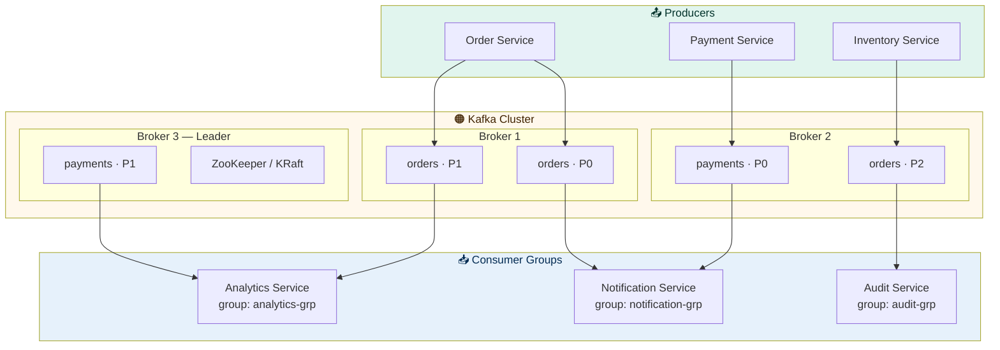

### Key Concepts at a Glance

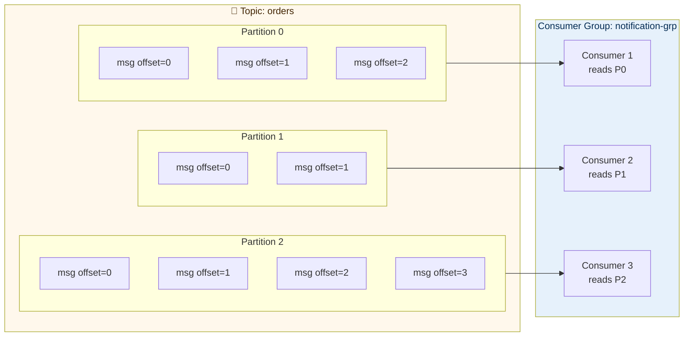

### Golden Rules — Memorise These

```
✅ 1 partition → consumed by exactly 1 consumer in a group
✅ 1 consumer → can consume from multiple partitions
✅ consumers > partitions → extra consumers sit IDLE
✅ partitions = max parallelism for a consumer group
✅ messages in a partition → strictly ordered
✅ messages across partitions → NOT ordered
✅ same key → always same partition → ordered per key
```

---

## 2. Topic Design & Naming

### ✅ Naming Convention

```
Format:  {domain}.{entity}.{event-type}
Example: orders.order.created
         payments.payment.failed
         inventory.stock.updated
         users.user.registered

With environment prefix:
         prod.orders.order.created
         staging.orders.order.created
         dev.orders.order.created
```

### ✅ Topic Design Principles

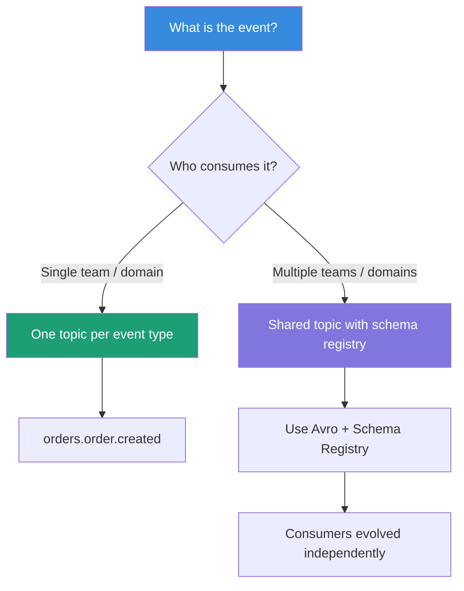

### ✅ Topic Configuration Reference

```yaml
# Topic creation via AdminClient
orders.order.created:
  partitions: 12             # start with 12 — scale later
  replication-factor: 3      # always 3 in production
  retention.ms: 604800000    # 7 days retention
  retention.bytes: -1        # unlimited size retention
  cleanup.policy: delete     # delete old segments
  min.insync.replicas: 2     # at least 2 replicas must ack
  compression.type: lz4      # compress for storage efficiency
```

### ❌ Common Topic Design Mistakes

| Mistake | Problem | Fix |
|---|---|---|
| One topic for everything | Consumers get events they don't need | Separate topic per event type |
| Too few partitions (1–2) | Cannot scale consumers | Start with 12 partitions minimum |
| Replication factor = 1 | Single broker failure = data loss | Always use 3 in production |
| Short retention (1 hour) | Consumer outage = missed events | Use 7 days minimum |
| Topic names with spaces | Breaks tooling and routing | Use dots or hyphens only |

---

## 3. Producer Best Practices

### Producer Flow

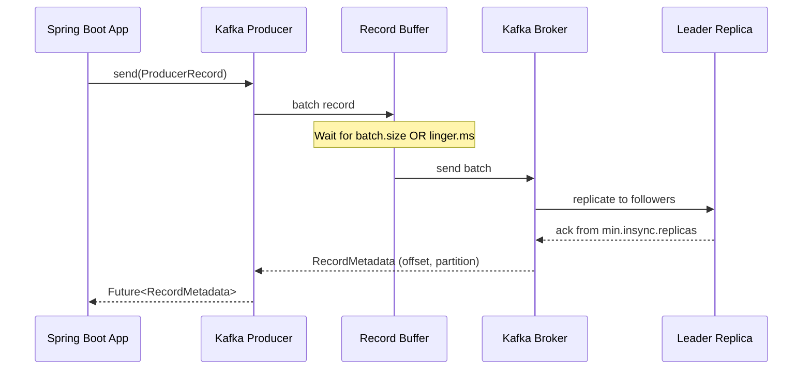

### ✅ Producer Configuration

```yaml
spring:
  kafka:
    producer:
      bootstrap-servers: ${KAFKA_BOOTSTRAP_SERVERS}
      key-serializer: org.apache.kafka.common.serialization.StringSerializer
      value-serializer: io.confluent.kafka.serializers.KafkaAvroSerializer

      # Reliability
      acks: all                    # wait for all in-sync replicas
      retries: 3                   # retry on transient failures
      retry-backoff-ms: 1000       # 1s between retries

      # Performance
      batch-size: 32768            # 32KB batch size
      linger-ms: 5                 # wait 5ms to fill batch
      buffer-memory: 33554432      # 32MB send buffer
      compression-type: lz4        # compress batches

      # Idempotency — prevents duplicate messages on retry
      enable-idempotence: true
      max-in-flight-requests-per-connection: 5

      properties:
        schema.registry.url: ${SCHEMA_REGISTRY_URL}
```

### ✅ Producer Acknowledgement Modes

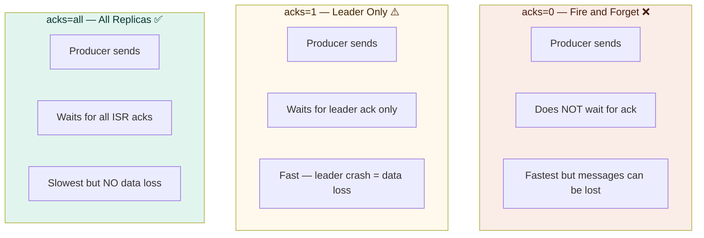

### ✅ Idempotent Producer — Prevent Duplicates

```
Without idempotence:
Producer sends → network hiccup → producer retries → DUPLICATE message!

With idempotence (enable.idempotence=true):
Producer sends → network hiccup → producer retries
Broker detects duplicate via sequence number → drops it ✓
Exactly-once delivery within a session
```

### ✅ Producer Code — Spring Boot

```java
@Service
@Slf4j
public class OrderEventProducer {

    private final KafkaTemplate<String, OrderEvent> kafkaTemplate;
    private static final String TOPIC = "orders.order.created";

    // ✅ Always use key for ordering — same order ID = same partition
    public void publishOrderCreated(Order order) {
        OrderEvent event = OrderEvent.builder()
            .orderId(order.getId())
            .customerId(order.getCustomerId())
            .status(order.getStatus())
            .timestamp(Instant.now())
            .build();

        kafkaTemplate.send(TOPIC, order.getId().toString(), event)
            .whenComplete((result, ex) -> {
                if (ex != null) {
                    log.error("Failed to publish order event orderId={} error={}",
                        order.getId(), ex.getMessage());
                    // handle failure — retry, alert, dead letter
                } else {
                    log.info("Published order event orderId={} partition={} offset={}",
                        order.getId(),
                        result.getRecordMetadata().partition(),
                        result.getRecordMetadata().offset());
                }
            });
    }

    // ✅ Transactional producer — publish + DB in one atomic operation
    @Transactional
    public void publishWithTransaction(Order order) {
        orderRepository.save(order);         // DB write
        orderEventProducer.publish(order);   // Kafka write
        // Both succeed or both fail — no ghost events
    }
}
```

---

## 4. Consumer Best Practices

### Consumer Group Rebalancing

```mermaid
sequenceDiagram
    participant C1 as Consumer 1
    participant C2 as Consumer 2
    participant C3 as Consumer 3 (NEW)
    participant CG as Group Coordinator

    Note over C1,C2: Normal state - C1 reads P0+P1, C2 reads P2+P3
    C3->>CG: Join group
    CG->>C1: Stop consuming (rebalance)
    CG->>C2: Stop consuming (rebalance)
    Note over C1,C2,C3: All consumers PAUSED during rebalance
    CG->>C1: Assigned P0
    CG->>C2: Assigned P1+P2
    CG->>C3: Assigned P3
    Note over C1,C2,C3: Consuming resumes
```

> ⚠️ **Rebalancing pauses ALL consumers in the group**  
> Minimise rebalances by keeping consumers alive and using static membership.

### ✅ Consumer Configuration

```yaml
spring:
  kafka:
    consumer:
      bootstrap-servers: ${KAFKA_BOOTSTRAP_SERVERS}
      group-id: order-notification-service
      key-deserializer: org.apache.kafka.common.serialization.StringDeserializer
      value-deserializer: io.confluent.kafka.serializers.KafkaAvroDeserializer

      # Offset management
      auto-offset-reset: earliest     # start from beginning if no offset saved
      enable-auto-commit: false        # ✅ ALWAYS false — manual commit only

      # Performance
      max-poll-records: 100           # process 100 messages per poll
      fetch-min-bytes: 1024           # wait for 1KB before fetching
      fetch-max-wait-ms: 500          # max 500ms wait for data

      # Stability — prevent unnecessary rebalances
      session-timeout-ms: 30000       # 30s — declare consumer dead if no heartbeat
      heartbeat-interval-ms: 10000    # send heartbeat every 10s
      max-poll-interval-ms: 300000    # max 5 min to process a batch

      properties:
        schema.registry.url: ${SCHEMA_REGISTRY_URL}
        isolation.level: read_committed   # only read committed transactions
```

### ✅ Consumer Code — Spring Boot

```java
@Service
@Slf4j
public class OrderEventConsumer {

    @KafkaListener(
        topics = "orders.order.created",
        groupId = "notification-service",
        concurrency = "3"              // 3 consumer threads = 3 partitions consumed in parallel
    )
    public void consumeOrderCreated(
            @Payload OrderEvent event,
            @Header(KafkaHeaders.RECEIVED_PARTITION) int partition,
            @Header(KafkaHeaders.OFFSET) long offset,
            Acknowledgment acknowledgment) {

        log.info("Consuming order event orderId={} partition={} offset={}",
            event.getOrderId(), partition, offset);

        try {
            notificationService.sendOrderConfirmation(event);

            // ✅ Commit ONLY after successful processing
            acknowledgment.acknowledge();
            log.info("Committed offset={} for orderId={}", offset, event.getOrderId());

        } catch (NonRetryableException ex) {
            // Business error — do NOT retry, send to DLQ
            log.error("Non-retryable error for orderId={}", event.getOrderId(), ex);
            deadLetterQueueService.send(event, ex);
            acknowledgment.acknowledge();   // commit to move past this message

        } catch (RetryableException ex) {
            // Transient error — do NOT commit, allow retry
            log.warn("Retryable error for orderId={}, will retry", event.getOrderId(), ex);
            throw ex;                       // Spring retries automatically
        }
    }
}
```

### ✅ Concurrency vs Partition Count

```
Rule: concurrency should NEVER exceed partition count

Example:
  Topic partitions: 6
  concurrency=3 → 3 threads, each reading 2 partitions ✅
  concurrency=6 → 6 threads, each reading 1 partition ✅ (max parallelism)
  concurrency=8 → 8 threads, but 2 sit IDLE ❌ (wasted resources)

In Kubernetes:
  3 pods × concurrency=2 = 6 consumer threads = 6 partitions ✅
```

---

## 5. Partitioning Strategy

### How Partitioning Works

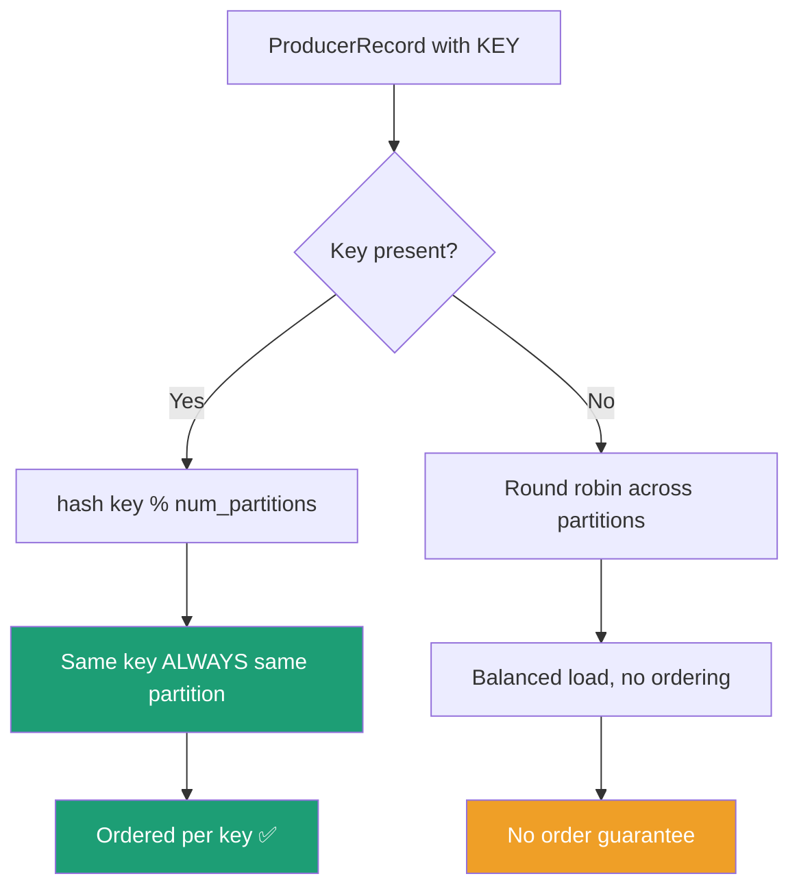

### ✅ Key Selection Strategy

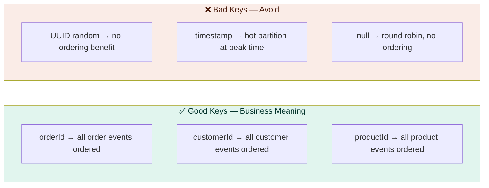

### Partition Count Guidelines

```
Start with:
  Low-throughput topic (< 1000 msg/s)    → 6 partitions
  Medium-throughput (1000–10000 msg/s)   → 12 partitions
  High-throughput (> 10000 msg/s)        → 24–48 partitions

Formula:
  target_partitions = max(
    target_throughput / throughput_per_partition,
    target_consumers
  )

  Where throughput_per_partition ≈ 10 MB/s (write) / 30 MB/s (read)

⚠️ Partitions can INCREASE but NEVER decrease — plan ahead!
```

### Hot Partition Problem

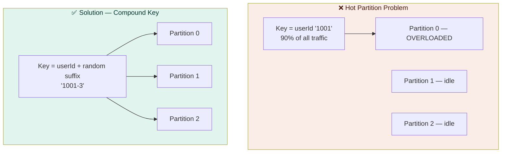

---

## 6. Message Schema & Avro

### ✅ Why Use Avro + Schema Registry

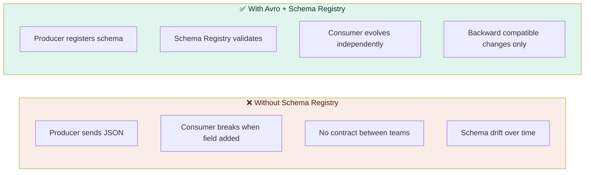

### Avro Schema Definition

```json
{
  "type": "record",
  "name": "OrderEvent",
  "namespace": "com.company.orders.events",
  "doc": "Event published when an order is created",
  "fields": [
    {
      "name": "orderId",
      "type": "long",
      "doc": "Unique order identifier"
    },
    {
      "name": "customerId",
      "type": "long",
      "doc": "Customer who placed the order"
    },
    {
      "name": "status",
      "type": {
        "type": "enum",
        "name": "OrderStatus",
        "symbols": ["PENDING", "CONFIRMED", "SHIPPED", "DELIVERED", "CANCELLED"]
      }
    },
    {
      "name": "totalAmount",
      "type": "double"
    },
    {
      "name": "currency",
      "type": "string",
      "default": "INR"
    },
    {
      "name": "timestamp",
      "type": "long",
      "logicalType": "timestamp-millis"
    },
    {
      "name": "metadata",
      "type": ["null", {"type": "map", "values": "string"}],
      "default": null,
      "doc": "Optional metadata — new field, backward compatible"
    }
  ]
}
```

### Schema Evolution Rules

```
✅ BACKWARD COMPATIBLE — Safe to deploy consumer first
   - Add optional field with default value
   - Remove field with default value

✅ FORWARD COMPATIBLE — Safe to deploy producer first
   - Add field (consumers ignore unknown fields)
   - Remove optional field

❌ BREAKING CHANGES — Never do this
   - Rename a field
   - Change field type (int → string)
   - Remove required field (no default)
   - Add required field (no default) — old producers can't produce
```

---

## 7. Error Handling & Dead Letter Queue

### ✅ Error Handling Flow

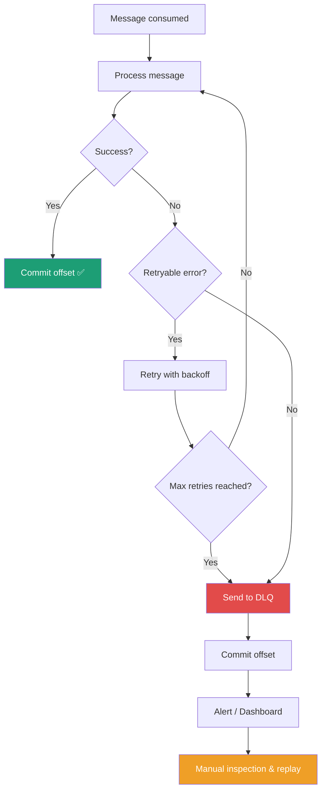

### ✅ Dead Letter Queue Pattern

```
Main topic:  orders.order.created
Retry topic: orders.order.created.retry.1
             orders.order.created.retry.2
             orders.order.created.retry.3
DLQ topic:   orders.order.created.dlt

Flow:
Message fails → retry.1 (wait 1s)
             → retry.2 (wait 10s)
             → retry.3 (wait 60s)
             → DLQ (manual intervention)
```

### Spring Boot DLQ Configuration

```java
@Configuration
public class KafkaErrorHandlerConfig {

    @Bean
    public DefaultErrorHandler errorHandler(KafkaTemplate<?, ?> kafkaTemplate) {
        // Retry 3 times with exponential backoff
        ExponentialBackOffWithMaxRetries backoff =
            new ExponentialBackOffWithMaxRetries(3);
        backoff.setInitialInterval(1_000L);    // 1 second
        backoff.setMultiplier(10.0);            // 1s → 10s → 100s
        backoff.setMaxInterval(60_000L);        // cap at 60s

        // Send to DLQ after retries exhausted
        DeadLetterPublishingRecoverer recoverer =
            new DeadLetterPublishingRecoverer(kafkaTemplate,
                (record, ex) -> new TopicPartition(
                    record.topic() + ".dlt",
                    record.partition()
                ));

        DefaultErrorHandler handler = new DefaultErrorHandler(recoverer, backoff);

        // Non-retryable exceptions — go straight to DLQ
        handler.addNotRetryableExceptions(
            IllegalArgumentException.class,
            ValidationException.class
        );

        return handler;
    }
}
```

### ✅ DLQ Consumer — For Manual Replay

```java
@Service
@Slf4j
public class DeadLetterQueueConsumer {

    @KafkaListener(
        topics = "orders.order.created.dlt",
        groupId = "dlt-inspector"
    )
    public void consumeDeadLetter(
            @Payload OrderEvent event,
            @Header(KafkaHeaders.EXCEPTION_MESSAGE) String errorMessage,
            @Header(KafkaHeaders.ORIGINAL_TOPIC) String originalTopic,
            @Header(KafkaHeaders.ORIGINAL_OFFSET) long originalOffset) {

        log.error("DLQ message received | topic={} offset={} error={} event={}",
            originalTopic, originalOffset, errorMessage, event);

        // Save to DB for investigation dashboard
        dlqRepository.save(DlqEntry.builder()
            .originalTopic(originalTopic)
            .originalOffset(originalOffset)
            .errorMessage(errorMessage)
            .payload(event.toString())
            .receivedAt(Instant.now())
            .build());

        // Alert operations team
        alertService.sendDlqAlert(originalTopic, errorMessage);
    }
}
```

---

## 8. Offset Management

### ✅ Offset Commit Strategies

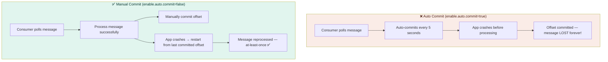

### Delivery Guarantees

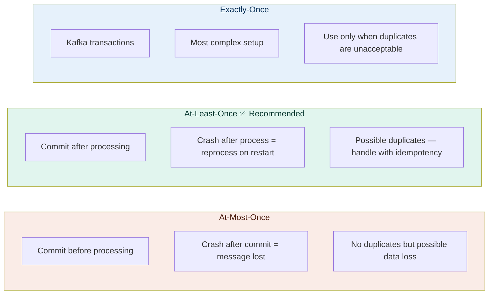

### ✅ Idempotent Consumer — Handle Duplicates Safely

```java
@Service
public class OrderEventConsumer {

    @KafkaListener(topics = "orders.order.created")
    public void consume(OrderEvent event, Acknowledgment ack) {
        // ✅ Check if already processed — idempotency key
        if (processedEventRepository.existsByEventId(event.getEventId())) {
            log.info("Duplicate event skipped eventId={}", event.getEventId());
            ack.acknowledge();
            return;
        }

        // Process the event
        notificationService.send(event);

        // Record as processed
        processedEventRepository.save(
            ProcessedEvent.of(event.getEventId(), Instant.now())
        );

        ack.acknowledge();
    }
}
```

---

## 9. Security

### ✅ Kafka Security Layers

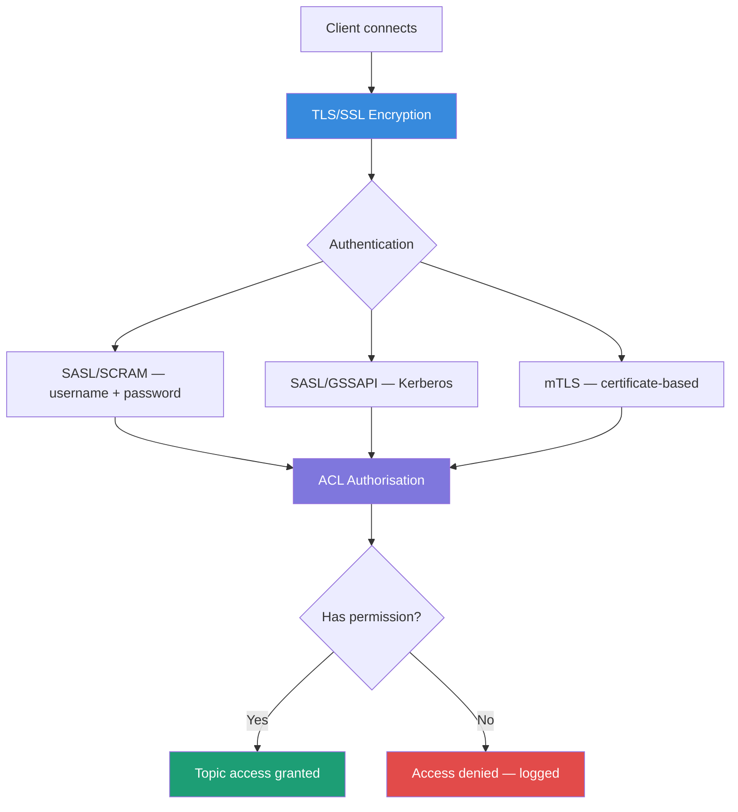

### ✅ ACL Best Practices

```bash
# Producer — only write permission to specific topic
kafka-acls.sh --bootstrap-server kafka:9092 \
  --add \
  --allow-principal User:order-service \
  --operation Write \
  --topic orders.order.created

# Consumer — only read permission with specific group
kafka-acls.sh --bootstrap-server kafka:9092 \
  --add \
  --allow-principal User:notification-service \
  --operation Read \
  --topic orders.order.created \
  --group notification-service-grp

# ❌ Never do this — too permissive
kafka-acls.sh --add \
  --allow-principal User:* \
  --operation All \
  --topic '*'
```

### SSL Configuration — Spring Boot

```yaml
spring:
  kafka:
    properties:
      security.protocol: SASL_SSL
      sasl.mechanism: SCRAM-SHA-512
      sasl.jaas.config: |
        org.apache.kafka.common.security.scram.ScramLoginModule required
        username="${KAFKA_USERNAME}"
        password="${KAFKA_PASSWORD}";
      ssl.truststore.location: /etc/kafka/ssl/kafka.truststore.jks
      ssl.truststore.password: ${KAFKA_TRUSTSTORE_PASSWORD}
```

---

## 10. Performance & Tuning

### Producer Performance Levers

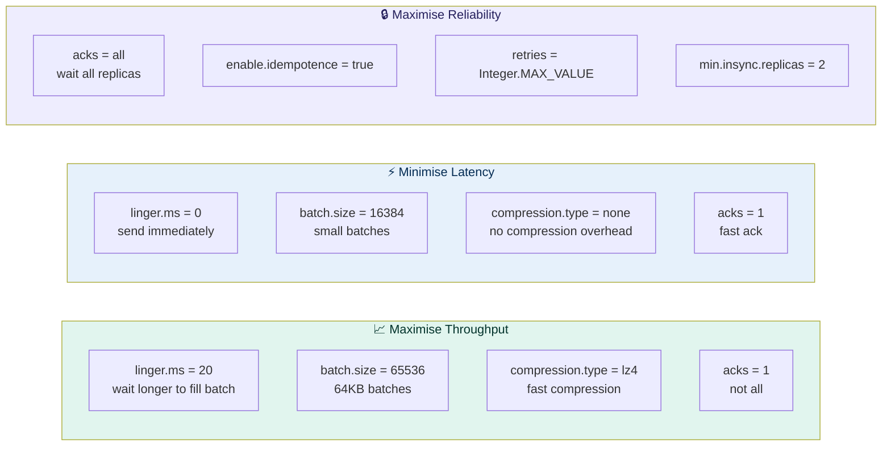

### Consumer Performance Tuning

```yaml
consumer:
  # Throughput optimisation
  max-poll-records: 500          # process 500 msgs per poll (default 500)
  fetch-min-bytes: 102400        # wait for 100KB before fetching
  fetch-max-wait-ms: 500         # max 500ms wait
  
  # Stability — prevent rebalances during slow processing
  max-poll-interval-ms: 600000   # 10 min — for slow batch processing
  session-timeout-ms: 45000      # 45s session timeout
  heartbeat-interval-ms: 15000   # heartbeat every 15s
```

### Key Performance Metrics to Watch

| Metric | Warning | Critical | Action |
|---|---|---|---|
| Consumer lag | > 10,000 | > 100,000 | Add consumers or partitions |
| Producer error rate | > 0.1% | > 1% | Check broker health |
| Broker disk usage | > 70% | > 85% | Reduce retention or add brokers |
| Under-replicated partitions | > 0 | > 5 | Check broker connectivity |
| Request handler idle % | < 30% | < 10% | Add brokers |
| Network throughput | > 70% | > 85% | Add brokers |

---

## 11. Monitoring & Observability

### ✅ Monitoring Stack

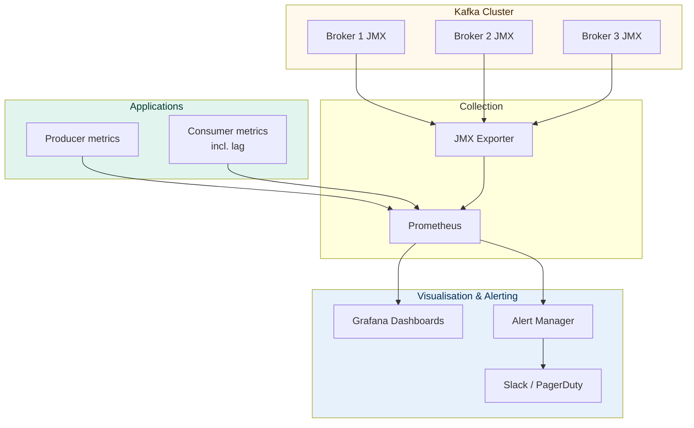

### ✅ Critical Alerts to Configure

```yaml
# Consumer lag alert — most important
- alert: KafkaConsumerLagHigh
  expr: kafka_consumer_group_lag > 10000
  for: 5m
  annotations:
    summary: "Consumer group {{ $labels.group }} lag is too high"
    description: "Topic {{ $labels.topic }} lag={{ $value }}"

# Under-replicated partitions — broker health
- alert: KafkaUnderReplicatedPartitions
  expr: kafka_server_replicamanager_underreplicatedpartitions > 0
  for: 1m
  annotations:
    summary: "Under-replicated partitions detected"

# Producer error rate
- alert: KafkaProducerErrorRateHigh
  expr: rate(kafka_producer_record_error_rate[5m]) > 0.01
  for: 2m
  annotations:
    summary: "Producer error rate > 1%"

# DLQ messages — requires manual attention
- alert: KafkaDLQMessagesDetected
  expr: kafka_topic_partitions_messages_in_rate{topic=~".*\\.dlt"} > 0
  for: 1m
  annotations:
    summary: "Messages arriving in Dead Letter Queue"
```

### Consumer Lag Explained

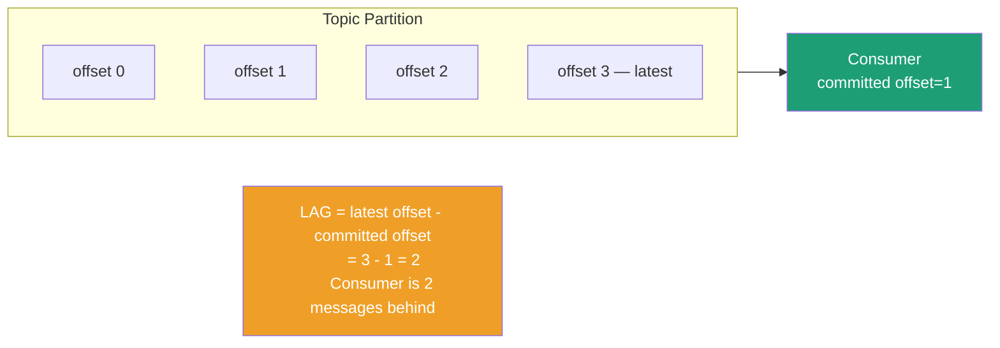

---

## 12. Kafka on AWS MSK

### ✅ MSK Configuration Recommendations

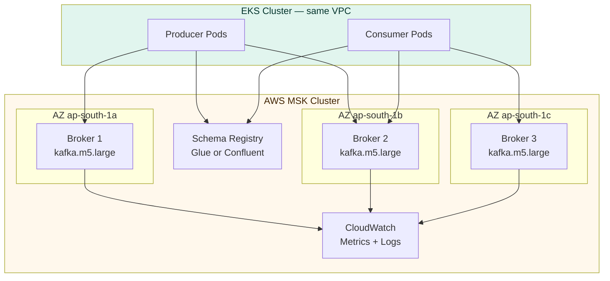

### MSK Checklist

```
Infrastructure:
☐ 3 brokers across 3 AZs (minimum)
☐ kafka.m5.large for medium workloads
☐ kafka.m5.2xlarge for high throughput
☐ MSK in same VPC as EKS
☐ Private subnets only — no public access
☐ Security group — allow 9092 (plaintext) or 9094 (TLS) from EKS SG only

Storage:
☐ EBS gp3 storage — better performance than gp2
☐ Storage auto-scaling enabled
☐ Start with 100GB per broker — monitor disk usage

Security:
☐ TLS encryption in-transit enabled
☐ SASL/SCRAM authentication enabled
☐ Unauthenticated access disabled
☐ Client authentication required

Reliability:
☐ replication.factor=3 on all topics
☐ min.insync.replicas=2 on all topics
☐ automatic.failover enabled
☐ Multi-AZ deployment

Monitoring:
☐ CloudWatch metrics enabled
☐ Broker log delivery to S3
☐ Consumer lag monitoring via CloudWatch
☐ Alerts on under-replicated partitions
```

---

## 13. Spring Boot Integration

### ✅ Full Spring Boot Kafka Setup

```java
@Configuration
@EnableKafka
public class KafkaConfig {

    @Value("${spring.kafka.bootstrap-servers}")
    private String bootstrapServers;

    // ── PRODUCER ──────────────────────────────────────────────────
    @Bean
    public ProducerFactory<String, Object> producerFactory() {
        Map<String, Object> props = new HashMap<>();
        props.put(ProducerConfig.BOOTSTRAP_SERVERS_CONFIG, bootstrapServers);
        props.put(ProducerConfig.KEY_SERIALIZER_CLASS_CONFIG, StringSerializer.class);
        props.put(ProducerConfig.VALUE_SERIALIZER_CLASS_CONFIG, KafkaAvroSerializer.class);
        props.put(ProducerConfig.ACKS_CONFIG, "all");
        props.put(ProducerConfig.ENABLE_IDEMPOTENCE_CONFIG, true);
        props.put(ProducerConfig.RETRIES_CONFIG, 3);
        props.put(ProducerConfig.LINGER_MS_CONFIG, 5);
        props.put(ProducerConfig.BATCH_SIZE_CONFIG, 32768);
        props.put(ProducerConfig.COMPRESSION_TYPE_CONFIG, "lz4");
        props.put("schema.registry.url", schemaRegistryUrl);
        return new DefaultKafkaProducerFactory<>(props);
    }

    @Bean
    public KafkaTemplate<String, Object> kafkaTemplate() {
        return new KafkaTemplate<>(producerFactory());
    }

    // ── CONSUMER ──────────────────────────────────────────────────
    @Bean
    public ConsumerFactory<String, Object> consumerFactory() {
        Map<String, Object> props = new HashMap<>();
        props.put(ConsumerConfig.BOOTSTRAP_SERVERS_CONFIG, bootstrapServers);
        props.put(ConsumerConfig.GROUP_ID_CONFIG, "order-service");
        props.put(ConsumerConfig.KEY_DESERIALIZER_CLASS_CONFIG, StringDeserializer.class);
        props.put(ConsumerConfig.VALUE_DESERIALIZER_CLASS_CONFIG, KafkaAvroDeserializer.class);
        props.put(ConsumerConfig.ENABLE_AUTO_COMMIT_CONFIG, false);
        props.put(ConsumerConfig.AUTO_OFFSET_RESET_CONFIG, "earliest");
        props.put(ConsumerConfig.MAX_POLL_RECORDS_CONFIG, 100);
        props.put(ConsumerConfig.MAX_POLL_INTERVAL_MS_CONFIG, 300000);
        props.put("schema.registry.url", schemaRegistryUrl);
        props.put("specific.avro.reader", true);
        return new DefaultKafkaConsumerFactory<>(props);
    }

    @Bean
    public ConcurrentKafkaListenerContainerFactory<String, Object> kafkaListenerContainerFactory() {
        ConcurrentKafkaListenerContainerFactory<String, Object> factory =
            new ConcurrentKafkaListenerContainerFactory<>();
        factory.setConsumerFactory(consumerFactory());
        factory.setConcurrency(3);              // 3 consumer threads per listener
        factory.getContainerProperties()
            .setAckMode(ContainerProperties.AckMode.MANUAL_IMMEDIATE);
        factory.setCommonErrorHandler(errorHandler(kafkaTemplate()));
        return factory;
    }

    // ── TOPICS ────────────────────────────────────────────────────
    @Bean
    public NewTopic orderCreatedTopic() {
        return TopicBuilder.name("orders.order.created")
            .partitions(12)
            .replicas(3)
            .config(TopicConfig.RETENTION_MS_CONFIG, "604800000")     // 7 days
            .config(TopicConfig.COMPRESSION_TYPE_CONFIG, "lz4")
            .config(TopicConfig.MIN_IN_SYNC_REPLICAS_CONFIG, "2")
            .build();
    }

    @Bean
    public NewTopic orderCreatedDltTopic() {
        return TopicBuilder.name("orders.order.created.dlt")
            .partitions(12)
            .replicas(3)
            .config(TopicConfig.RETENTION_MS_CONFIG, "2592000000")    // 30 days for DLQ
            .build();
    }
}
```

### ✅ Transactional Outbox Pattern

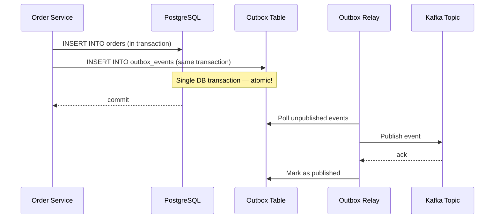

```java
// ✅ Outbox pattern — prevents ghost events
@Transactional
public Order createOrder(CreateOrderRequest request) {
    // Step 1 — Save order to DB
    Order order = orderRepository.save(orderMapper.toEntity(request));

    // Step 2 — Save event to outbox IN SAME TRANSACTION
    OutboxEvent outboxEvent = OutboxEvent.builder()
        .aggregateId(order.getId().toString())
        .aggregateType("Order")
        .eventType("OrderCreated")
        .payload(objectMapper.writeValueAsString(order))
        .createdAt(Instant.now())
        .published(false)
        .build();
    outboxRepository.save(outboxEvent);

    // Both committed atomically — no ghost events, no missed events
    return order;
}

// Separate relay publishes from outbox to Kafka
@Scheduled(fixedDelay = 1000)
public void relayOutboxEvents() {
    List<OutboxEvent> unpublished = outboxRepository.findByPublishedFalse();
    unpublished.forEach(event -> {
        kafkaTemplate.send(topicFor(event.getEventType()), event.getAggregateId(), event.getPayload());
        event.setPublished(true);
        outboxRepository.save(event);
    });
}
```

---

## 📊 Complete Best Practices Checklist

### 🏗️ Topic Design
- [ ] Naming convention: `{domain}.{entity}.{event-type}`
- [ ] Minimum 12 partitions for production topics
- [ ] Replication factor = 3 always
- [ ] min.insync.replicas = 2 always
- [ ] Retention minimum 7 days
- [ ] DLQ topic created for every consumer topic
- [ ] Compression enabled (lz4)

### 📤 Producer
- [ ] `acks=all` for reliability
- [ ] `enable.idempotence=true`
- [ ] `linger.ms` and `batch.size` tuned
- [ ] Meaningful message key set
- [ ] Avro schema registered in Schema Registry
- [ ] Send result handled (no fire and forget)
- [ ] Transactional outbox for DB + Kafka atomicity

### 📥 Consumer
- [ ] `enable.auto.commit=false`
- [ ] Manual offset commit after successful processing
- [ ] `concurrency` ≤ partition count
- [ ] Idempotent consumer (duplicate check)
- [ ] DLQ configured with retry backoff
- [ ] Non-retryable exceptions go directly to DLQ
- [ ] `max.poll.interval.ms` tuned for processing time

### 🔒 Security
- [ ] TLS encryption in transit
- [ ] SASL authentication enabled
- [ ] ACLs per service (least privilege)
- [ ] No `*` ACLs in production
- [ ] Credentials from Secrets Manager

### 📊 Observability
- [ ] Consumer lag monitored and alerted
- [ ] Under-replicated partitions alerted
- [ ] DLQ arrival alerted
- [ ] Producer error rate alerted
- [ ] Grafana dashboard for Kafka metrics
- [ ] Structured logs with correlation IDs

### ☁️ AWS MSK
- [ ] 3 brokers across 3 AZs
- [ ] Same VPC as EKS
- [ ] Private subnets only
- [ ] Storage auto-scaling enabled
- [ ] CloudWatch metrics enabled

---

## 🚦 Priority Summary

| Priority | Practice | Risk if Skipped |
|---|---|---|
| 🔴 **P1** | `acks=all` + `min.insync.replicas=2` | Data loss on broker failure |
| 🔴 **P1** | `enable.auto.commit=false` | Messages lost on consumer crash |
| 🔴 **P1** | replication-factor=3 | Single broker failure = data loss |
| 🔴 **P1** | Meaningful message keys | No ordering, hot partitions |
| 🔴 **P1** | DLQ configured | Failed messages silently lost |
| 🔴 **P1** | Avro + Schema Registry | Schema drift breaks consumers |
| 🟡 **P2** | Idempotent consumer | Duplicate processing on rebalance |
| 🟡 **P2** | Consumer lag monitoring | Silent consumer backlog build-up |
| 🟡 **P2** | Retry with exponential backoff | Thundering herd on transient failures |
| 🟡 **P2** | Outbox pattern | Ghost events or missed events |
| 🟡 **P2** | ACLs per service | Rogue service can consume any topic |
| 🟢 **P3** | Compression (lz4) | Higher storage costs |
| 🟢 **P3** | Partition count tuning | Suboptimal consumer parallelism |
| 🟢 **P3** | Multi-stage consumer lag alerts | Delayed response to consumer issues |

---

*Document version 1.0 · Solution Architecture Team · March 2026*  
*Apache Kafka · Spring Boot 3.x · AWS MSK · Production Grade*
