# 📨 Apache Kafka Best Practices
### Solution Architect Guide — Production-Grade Event-Driven Microservices

> **Audience:** Backend Engineers · Solution Architects · Tech Leads  
> **Stack:** Apache Kafka · Spring Boot 3.x · AWS MSK · Microservices  
> **Version:** 1.0 · March 2026

---

## 📋 Table of Contents

| # | Topic | Priority |
|---|---|---|
| 1 | [Core Concepts & Architecture](#1-core-concepts--architecture) | 🔴 P1 |
| 2 | [Topic Design & Naming](#2-topic-design--naming) | 🔴 P1 |
| 3 | [Producer Best Practices](#3-producer-best-practices) | 🔴 P1 |
| 4 | [Consumer Best Practices](#4-consumer-best-practices) | 🔴 P1 |
| 5 | [Partitioning Strategy](#5-partitioning-strategy) | 🔴 P1 |
| 6 | [Message Schema & Avro](#6-message-schema--avro) | 🔴 P1 |
| 7 | [Error Handling & Dead Letter Queue](#7-error-handling--dead-letter-queue) | 🟡 P2 |
| 8 | [Offset Management](#8-offset-management) | 🟡 P2 |
| 9 | [Security](#9-security) | 🟡 P2 |
| 10 | [Performance & Tuning](#10-performance--tuning) | 🟡 P2 |
| 11 | [Monitoring & Observability](#11-monitoring--observability) | 🟡 P2 |
| 12 | [Kafka on AWS MSK](#12-kafka-on-aws-msk) | 🟢 P3 |
| 13 | [Spring Boot Integration](#13-spring-boot-integration) | 🟢 P3 |

---

## 1. Core Concepts & Architecture

### Kafka Architecture Overview

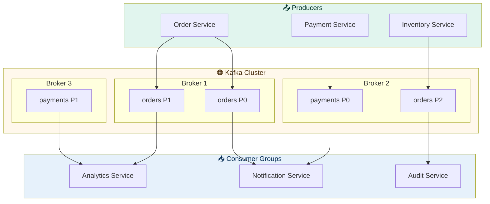

### Partition and Consumer Group Layout

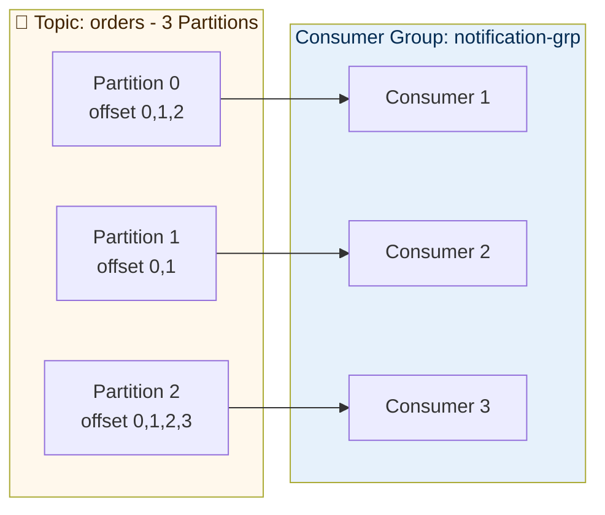

### Golden Rules

```
1 partition   → consumed by exactly 1 consumer in a group
1 consumer    → can consume from multiple partitions
consumers > partitions → extra consumers sit IDLE
partitions    = max parallelism for a consumer group
same key      → always same partition → ordered per key
different partitions → NOT ordered across each other
```

---

## 2. Topic Design & Naming

### Naming Convention

```
Format:   {domain}.{entity}.{event-type}

Examples:
  orders.order.created
  payments.payment.failed
  inventory.stock.updated
  users.user.registered

With environment prefix:
  prod.orders.order.created
  staging.orders.order.created
  dev.orders.order.created
```

### Topic Design Decision Flow

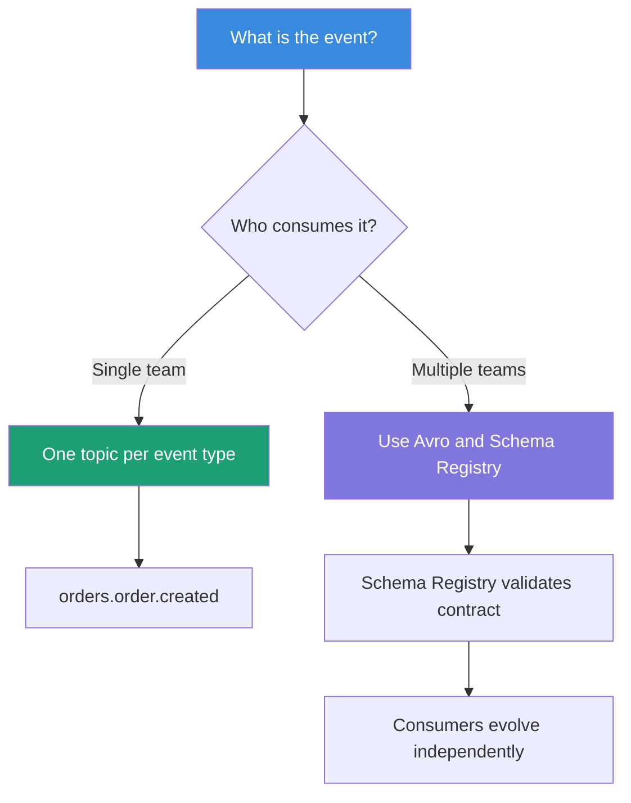

### Topic Configuration Reference

```yaml
orders.order.created:
  partitions: 12
  replication-factor: 3
  retention.ms: 604800000         # 7 days
  cleanup.policy: delete
  min.insync.replicas: 2
  compression.type: lz4
```

### Common Topic Design Mistakes

| Mistake | Problem | Fix |
|---|---|---|
| One topic for everything | Consumers get irrelevant events | Separate topic per event type |
| Too few partitions (1-2) | Cannot scale consumers | Start with 12 partitions minimum |
| Replication factor = 1 | Broker failure = data loss | Always use 3 in production |
| Short retention (1 hour) | Consumer outage = missed events | Use 7 days minimum |
| Topic names with spaces | Breaks tooling | Use dots or hyphens only |

---

## 3. Producer Best Practices

### Producer Send Flow

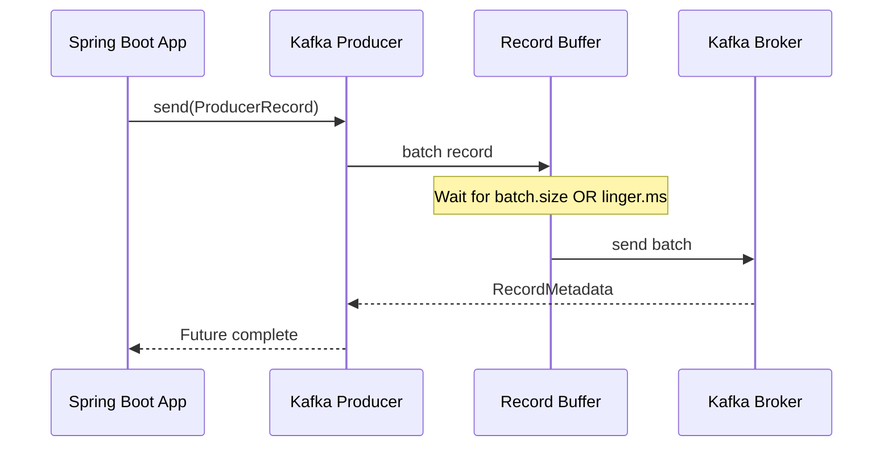

### Producer Acknowledgement Modes

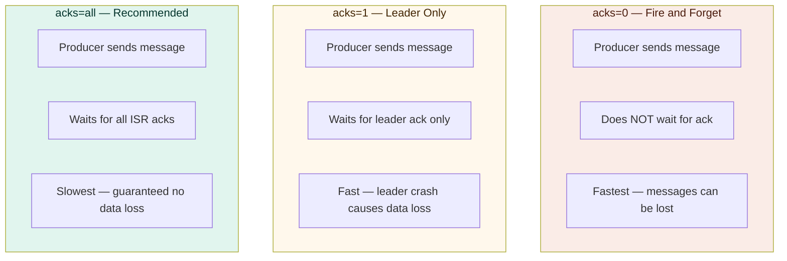

### Producer Configuration

```yaml
spring:
  kafka:
    producer:
      bootstrap-servers: ${KAFKA_BOOTSTRAP_SERVERS}
      key-serializer: org.apache.kafka.common.serialization.StringSerializer
      value-serializer: io.confluent.kafka.serializers.KafkaAvroSerializer
      acks: all
      retries: 3
      retry-backoff-ms: 1000
      batch-size: 32768
      linger-ms: 5
      buffer-memory: 33554432
      compression-type: lz4
      enable-idempotence: true
      max-in-flight-requests-per-connection: 5
      properties:
        schema.registry.url: ${SCHEMA_REGISTRY_URL}
```

### Idempotent Producer — Why It Matters

```
Without idempotence:
  Producer sends → network hiccup → producer retries → DUPLICATE message

With enable.idempotence=true:
  Producer sends → network hiccup → producer retries
  Broker detects duplicate via sequence number → drops it
  Result: exactly-once delivery within a session
```

### Producer Code

```java
@Service
@Slf4j
public class OrderEventProducer {

    private final KafkaTemplate<String, OrderEvent> kafkaTemplate;
    private static final String TOPIC = "orders.order.created";

    public void publishOrderCreated(Order order) {
        OrderEvent event = OrderEvent.builder()
            .orderId(order.getId())
            .customerId(order.getCustomerId())
            .status(order.getStatus())
            .timestamp(Instant.now())
            .build();

        // Always use a meaningful key for ordering
        kafkaTemplate.send(TOPIC, order.getId().toString(), event)
            .whenComplete((result, ex) -> {
                if (ex != null) {
                    log.error("Failed to publish orderId={} error={}",
                        order.getId(), ex.getMessage());
                } else {
                    log.info("Published orderId={} partition={} offset={}",
                        order.getId(),
                        result.getRecordMetadata().partition(),
                        result.getRecordMetadata().offset());
                }
            });
    }
}
```

---

## 4. Consumer Best Practices

### Consumer Group Rebalancing

```mermaid
sequenceDiagram
    participant C1 as Consumer 1
    participant C2 as Consumer 2
    participant C3 as Consumer 3 NEW
    participant CG as Group Coordinator

    Note over C1,C2: C1 reads P0 and P1. C2 reads P2 and P3.
    C3->>CG: Join group
    CG->>C1: Stop consuming — rebalance triggered
    CG->>C2: Stop consuming — rebalance triggered
    Note over C1,C2,C3: All consumers paused during rebalance
    CG->>C1: Assigned Partition 0
    CG->>C2: Assigned Partitions 1 and 2
    CG->>C3: Assigned Partition 3
    Note over C1,C2,C3: Consuming resumes with new assignment
```

> **Warning:** Rebalancing pauses ALL consumers in the group.  
> Minimise rebalances by keeping consumers alive and tuning `session.timeout.ms`.

### Consumer Configuration

```yaml
spring:
  kafka:
    consumer:
      bootstrap-servers: ${KAFKA_BOOTSTRAP_SERVERS}
      group-id: order-notification-service
      key-deserializer: org.apache.kafka.common.serialization.StringDeserializer
      value-deserializer: io.confluent.kafka.serializers.KafkaAvroDeserializer
      auto-offset-reset: earliest
      enable-auto-commit: false        # Always false — use manual commit
      max-poll-records: 100
      fetch-min-bytes: 1024
      fetch-max-wait-ms: 500
      session-timeout-ms: 30000
      heartbeat-interval-ms: 10000
      max-poll-interval-ms: 300000
      properties:
        schema.registry.url: ${SCHEMA_REGISTRY_URL}
        isolation.level: read_committed
```

### Consumer Code

```java
@Service
@Slf4j
public class OrderEventConsumer {

    @KafkaListener(
        topics = "orders.order.created",
        groupId = "notification-service",
        concurrency = "3"
    )
    public void consumeOrderCreated(
            @Payload OrderEvent event,
            @Header(KafkaHeaders.RECEIVED_PARTITION) int partition,
            @Header(KafkaHeaders.OFFSET) long offset,
            Acknowledgment acknowledgment) {

        log.info("Consuming orderId={} partition={} offset={}",
            event.getOrderId(), partition, offset);

        try {
            notificationService.sendOrderConfirmation(event);

            // Commit ONLY after successful processing
            acknowledgment.acknowledge();

        } catch (NonRetryableException ex) {
            // Business error — send to DLQ, do not retry
            log.error("Non-retryable error orderId={}", event.getOrderId(), ex);
            deadLetterQueueService.send(event, ex);
            acknowledgment.acknowledge();

        } catch (RetryableException ex) {
            // Transient error — do NOT commit, Spring retries
            log.warn("Retryable error orderId={} will retry", event.getOrderId());
            throw ex;
        }
    }
}
```

### Concurrency vs Partition Count Rule

```
Rule: concurrency must NEVER exceed partition count

Topic has 6 partitions:
  concurrency=3 → 3 threads each reading 2 partitions  OK
  concurrency=6 → 6 threads each reading 1 partition   OK (max parallelism)
  concurrency=8 → 8 threads but 2 sit IDLE             WASTE

In Kubernetes:
  3 pods x concurrency=2 = 6 consumer threads = 6 partitions  IDEAL
```

---

## 5. Partitioning Strategy

### How Partitioning Works

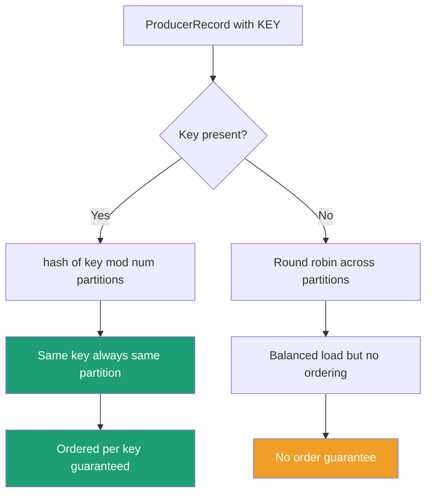

### Key Selection Strategy

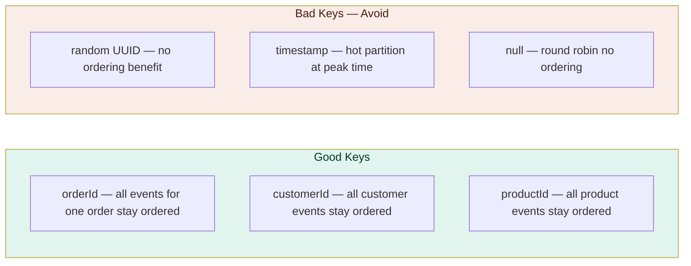

### Hot Partition Problem and Fix

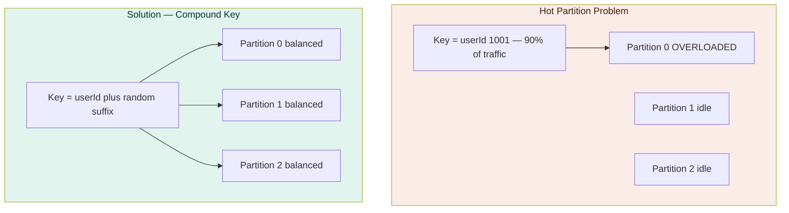

### Partition Count Guidelines

```
Low throughput  under 1000 msg/s      →  6 partitions
Medium          1000 to 10000 msg/s   →  12 partitions
High            over 10000 msg/s      →  24 to 48 partitions

Formula:
  target_partitions = max(
    target_throughput / throughput_per_partition,
    target_consumer_count
  )

  throughput_per_partition ≈ 10 MB/s write, 30 MB/s read

Warning: Partitions can INCREASE but NEVER decrease. Plan ahead!
```

---

## 6. Message Schema & Avro

### Why Schema Registry

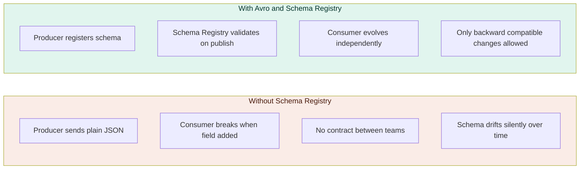

### Avro Schema Example

```json
{
  "type": "record",
  "name": "OrderEvent",
  "namespace": "com.company.orders.events",
  "fields": [
    { "name": "orderId",     "type": "long" },
    { "name": "customerId",  "type": "long" },
    { "name": "status",      "type": "string" },
    { "name": "totalAmount", "type": "double" },
    { "name": "currency",    "type": "string", "default": "INR" },
    { "name": "timestamp",   "type": "long", "logicalType": "timestamp-millis" },
    {
      "name": "metadata",
      "type": ["null", { "type": "map", "values": "string" }],
      "default": null,
      "doc": "Optional field — backward compatible"
    }
  ]
}
```

### Schema Evolution Rules

```
SAFE — Backward Compatible (deploy consumer first):
  Add optional field with default value
  Remove field that has a default value

SAFE — Forward Compatible (deploy producer first):
  Add any new field
  Remove an optional field

BREAKING — Never do these:
  Rename a field
  Change field type (int to string)
  Remove a required field without default
  Add a required field without default
```

---

## 7. Error Handling & Dead Letter Queue

### Error Handling Flow

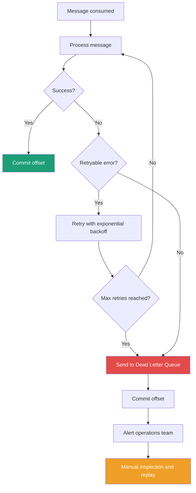

### Dead Letter Queue Topology

```
Main topic:    orders.order.created
Retry topics:  orders.order.created.retry-1   (wait 1s)
               orders.order.created.retry-2   (wait 10s)
               orders.order.created.retry-3   (wait 60s)
DLQ topic:     orders.order.created.dlt       (manual review)

Flow:
  Message fails
    → retry-1 after 1s
    → retry-2 after 10s
    → retry-3 after 60s
    → DLQ — requires manual intervention
```

### Spring Boot DLQ Configuration

```java
@Configuration
public class KafkaErrorHandlerConfig {

    @Bean
    public DefaultErrorHandler errorHandler(KafkaTemplate<?, ?> kafkaTemplate) {

        ExponentialBackOffWithMaxRetries backoff =
            new ExponentialBackOffWithMaxRetries(3);
        backoff.setInitialInterval(1_000L);
        backoff.setMultiplier(10.0);
        backoff.setMaxInterval(60_000L);

        DeadLetterPublishingRecoverer recoverer =
            new DeadLetterPublishingRecoverer(kafkaTemplate,
                (record, ex) -> new TopicPartition(
                    record.topic() + ".dlt",
                    record.partition()
                ));

        DefaultErrorHandler handler = new DefaultErrorHandler(recoverer, backoff);

        handler.addNotRetryableExceptions(
            IllegalArgumentException.class,
            ValidationException.class
        );

        return handler;
    }
}
```

### DLQ Consumer for Manual Replay

```java
@Service
@Slf4j
public class DeadLetterQueueConsumer {

    @KafkaListener(
        topics = "orders.order.created.dlt",
        groupId = "dlt-inspector"
    )
    public void consumeDeadLetter(
            @Payload OrderEvent event,
            @Header(KafkaHeaders.EXCEPTION_MESSAGE) String errorMessage,
            @Header(KafkaHeaders.ORIGINAL_TOPIC) String originalTopic,
            @Header(KafkaHeaders.ORIGINAL_OFFSET) long originalOffset) {

        log.error("DLQ message | topic={} offset={} error={}",
            originalTopic, originalOffset, errorMessage);

        dlqRepository.save(DlqEntry.builder()
            .originalTopic(originalTopic)
            .originalOffset(originalOffset)
            .errorMessage(errorMessage)
            .payload(event.toString())
            .receivedAt(Instant.now())
            .build());

        alertService.sendDlqAlert(originalTopic, errorMessage);
    }
}
```

---

## 8. Offset Management

### Auto Commit vs Manual Commit

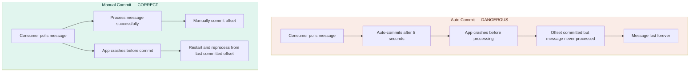

### Delivery Guarantee Comparison

| Guarantee | How | Duplicates | Data Loss | Use When |
|---|---|---|---|---|
| At-most-once | Commit before processing | Never | Possible | Logging, analytics |
| At-least-once | Commit after processing | Possible | Never | Most business events |
| Exactly-once | Kafka transactions | Never | Never | Financial transactions |

### Idempotent Consumer Pattern

```java
@Service
public class OrderEventConsumer {

    @KafkaListener(topics = "orders.order.created")
    public void consume(OrderEvent event, Acknowledgment ack) {

        // Check if already processed — prevents duplicate side effects
        if (processedEventRepository.existsByEventId(event.getEventId())) {
            log.info("Duplicate event skipped eventId={}", event.getEventId());
            ack.acknowledge();
            return;
        }

        notificationService.send(event);

        processedEventRepository.save(
            ProcessedEvent.of(event.getEventId(), Instant.now())
        );

        ack.acknowledge();
    }
}
```

---

## 9. Security

### Kafka Security Layers

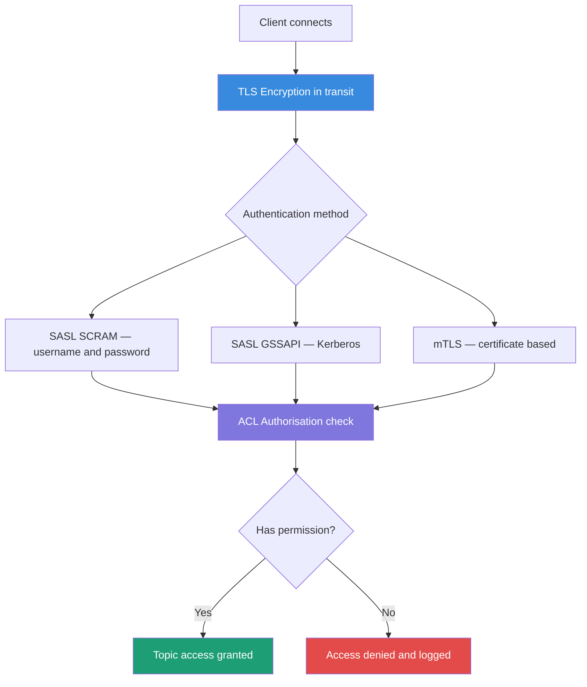

### ACL Best Practices

```bash
# Producer — write only to specific topic
kafka-acls.sh --bootstrap-server kafka:9092 \
  --add \
  --allow-principal User:order-service \
  --operation Write \
  --topic orders.order.created

# Consumer — read only with specific group
kafka-acls.sh --bootstrap-server kafka:9092 \
  --add \
  --allow-principal User:notification-service \
  --operation Read \
  --topic orders.order.created \
  --group notification-service-grp

# Never do this — too permissive
# --allow-principal User:* --operation All --topic '*'
```

### SSL Configuration in Spring Boot

```yaml
spring:
  kafka:
    properties:
      security.protocol: SASL_SSL
      sasl.mechanism: SCRAM-SHA-512
      sasl.jaas.config: >
        org.apache.kafka.common.security.scram.ScramLoginModule required
        username="${KAFKA_USERNAME}"
        password="${KAFKA_PASSWORD}";
      ssl.truststore.location: /etc/kafka/ssl/kafka.truststore.jks
      ssl.truststore.password: ${KAFKA_TRUSTSTORE_PASSWORD}
```

---

## 10. Performance & Tuning

### Producer Tuning — Choose Your Priority

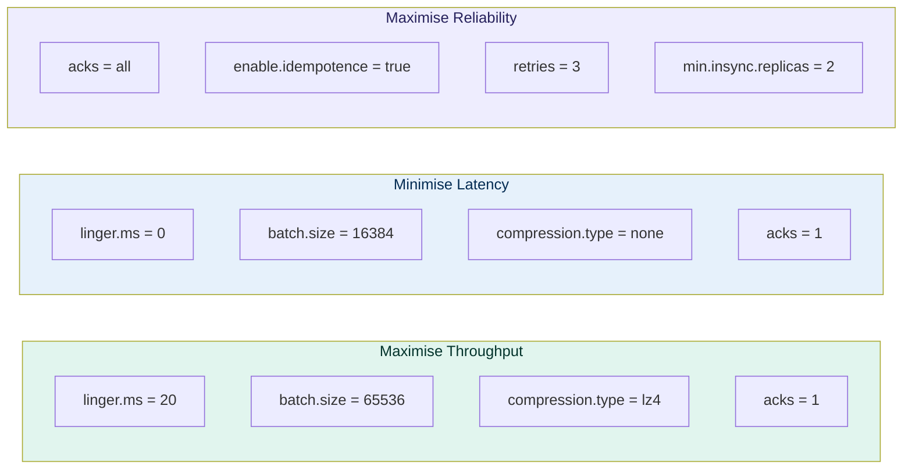

### Consumer Tuning

```yaml
consumer:
  max-poll-records: 500
  fetch-min-bytes: 102400
  fetch-max-wait-ms: 500
  max-poll-interval-ms: 600000
  session-timeout-ms: 45000
  heartbeat-interval-ms: 15000
```

### Key Metrics and Thresholds

| Metric | Warning | Critical | Action |
|---|---|---|---|
| Consumer lag | > 10,000 | > 100,000 | Add consumers or partitions |
| Producer error rate | > 0.1% | > 1% | Check broker health |
| Broker disk usage | > 70% | > 85% | Reduce retention or add brokers |
| Under-replicated partitions | > 0 | > 5 | Check broker connectivity |
| Request handler idle | < 30% | < 10% | Add brokers |

---

## 11. Monitoring & Observability

### Monitoring Stack

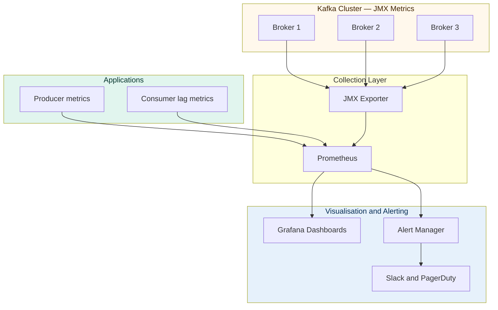

### Consumer Lag Explained

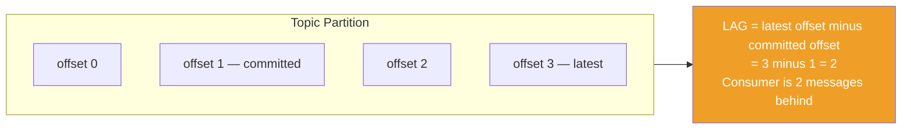

### Critical Alerts

```yaml
- alert: KafkaConsumerLagHigh
  expr: kafka_consumer_group_lag > 10000
  for: 5m
  annotations:
    summary: "Consumer lag too high on topic {{ $labels.topic }}"

- alert: KafkaUnderReplicatedPartitions
  expr: kafka_server_replicamanager_underreplicatedpartitions > 0
  for: 1m
  annotations:
    summary: "Under-replicated partitions detected"

- alert: KafkaDLQMessageDetected
  expr: kafka_topic_partitions_messages_in_rate{topic=~".*\\.dlt"} > 0
  for: 1m
  annotations:
    summary: "Messages arriving in Dead Letter Queue"

- alert: KafkaProducerErrorRate
  expr: rate(kafka_producer_record_error_rate[5m]) > 0.01
  for: 2m
  annotations:
    summary: "Producer error rate above 1%"
```

---

## 12. Kafka on AWS MSK

### MSK Architecture

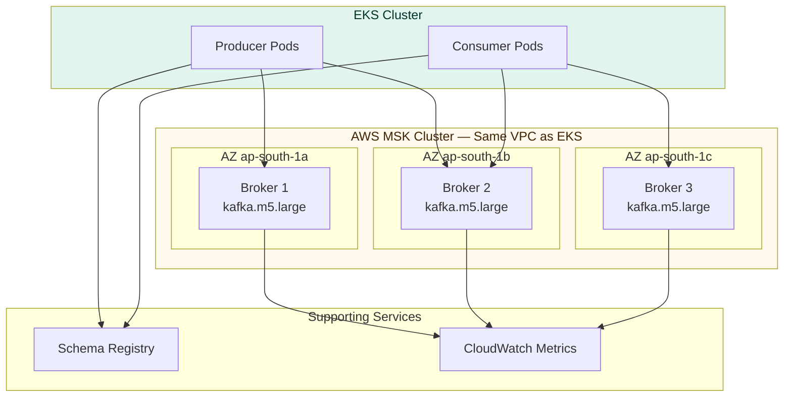

### MSK Setup Checklist

```
Infrastructure:
  3 brokers across 3 AZs minimum
  kafka.m5.large for medium workloads
  MSK in same VPC as EKS
  Private subnets only — no public access
  Security group: allow 9094 TLS from EKS SG only

Storage:
  EBS gp3 — better performance than gp2
  Storage auto-scaling enabled
  Start with 100GB per broker

Security:
  TLS encryption in-transit enabled
  SASL SCRAM authentication enabled
  Unauthenticated access disabled

Reliability:
  replication.factor=3 on all topics
  min.insync.replicas=2 on all topics
  Automatic failover enabled

Monitoring:
  CloudWatch metrics enabled
  Broker log delivery to S3
  Consumer lag monitored via CloudWatch
```

---

## 13. Spring Boot Integration

### Full Kafka Configuration Bean

```java
@Configuration
@EnableKafka
public class KafkaConfig {

    @Bean
    public ProducerFactory<String, Object> producerFactory() {
        Map<String, Object> props = new HashMap<>();
        props.put(ProducerConfig.BOOTSTRAP_SERVERS_CONFIG, bootstrapServers);
        props.put(ProducerConfig.KEY_SERIALIZER_CLASS_CONFIG, StringSerializer.class);
        props.put(ProducerConfig.VALUE_SERIALIZER_CLASS_CONFIG, KafkaAvroSerializer.class);
        props.put(ProducerConfig.ACKS_CONFIG, "all");
        props.put(ProducerConfig.ENABLE_IDEMPOTENCE_CONFIG, true);
        props.put(ProducerConfig.RETRIES_CONFIG, 3);
        props.put(ProducerConfig.LINGER_MS_CONFIG, 5);
        props.put(ProducerConfig.BATCH_SIZE_CONFIG, 32768);
        props.put(ProducerConfig.COMPRESSION_TYPE_CONFIG, "lz4");
        return new DefaultKafkaProducerFactory<>(props);
    }

    @Bean
    public ConsumerFactory<String, Object> consumerFactory() {
        Map<String, Object> props = new HashMap<>();
        props.put(ConsumerConfig.BOOTSTRAP_SERVERS_CONFIG, bootstrapServers);
        props.put(ConsumerConfig.GROUP_ID_CONFIG, "order-service");
        props.put(ConsumerConfig.KEY_DESERIALIZER_CLASS_CONFIG, StringDeserializer.class);
        props.put(ConsumerConfig.VALUE_DESERIALIZER_CLASS_CONFIG, KafkaAvroDeserializer.class);
        props.put(ConsumerConfig.ENABLE_AUTO_COMMIT_CONFIG, false);
        props.put(ConsumerConfig.AUTO_OFFSET_RESET_CONFIG, "earliest");
        props.put(ConsumerConfig.MAX_POLL_RECORDS_CONFIG, 100);
        props.put("specific.avro.reader", true);
        return new DefaultKafkaConsumerFactory<>(props);
    }

    @Bean
    public ConcurrentKafkaListenerContainerFactory<String, Object> kafkaListenerContainerFactory() {
        ConcurrentKafkaListenerContainerFactory<String, Object> factory =
            new ConcurrentKafkaListenerContainerFactory<>();
        factory.setConsumerFactory(consumerFactory());
        factory.setConcurrency(3);
        factory.getContainerProperties()
            .setAckMode(ContainerProperties.AckMode.MANUAL_IMMEDIATE);
        factory.setCommonErrorHandler(errorHandler(kafkaTemplate()));
        return factory;
    }

    @Bean
    public NewTopic orderCreatedTopic() {
        return TopicBuilder.name("orders.order.created")
            .partitions(12)
            .replicas(3)
            .config(TopicConfig.RETENTION_MS_CONFIG, "604800000")
            .config(TopicConfig.COMPRESSION_TYPE_CONFIG, "lz4")
            .config(TopicConfig.MIN_IN_SYNC_REPLICAS_CONFIG, "2")
            .build();
    }

    @Bean
    public NewTopic orderCreatedDltTopic() {
        return TopicBuilder.name("orders.order.created.dlt")
            .partitions(12)
            .replicas(3)
            .config(TopicConfig.RETENTION_MS_CONFIG, "2592000000")
            .build();
    }
}
```

### Transactional Outbox Pattern

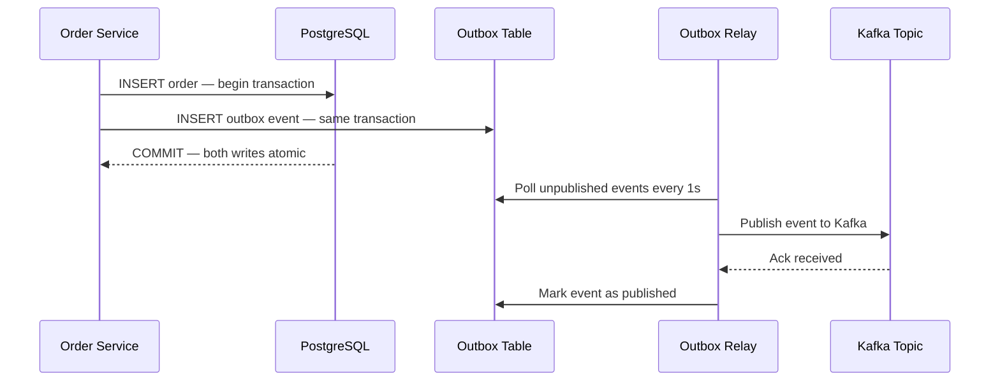

```java
@Transactional
public Order createOrder(CreateOrderRequest request) {

    // Step 1 — save order
    Order order = orderRepository.save(orderMapper.toEntity(request));

    // Step 2 — save outbox event IN SAME TRANSACTION
    outboxRepository.save(OutboxEvent.builder()
        .aggregateId(order.getId().toString())
        .eventType("OrderCreated")
        .payload(objectMapper.writeValueAsString(order))
        .published(false)
        .createdAt(Instant.now())
        .build());

    // Both commit atomically — no ghost events, no missed events
    return order;
}

// Relay publishes from outbox to Kafka every second
@Scheduled(fixedDelay = 1000)
public void relayOutboxEvents() {
    outboxRepository.findByPublishedFalse().forEach(event -> {
        kafkaTemplate.send(topicFor(event.getEventType()),
            event.getAggregateId(), event.getPayload());
        event.setPublished(true);
        outboxRepository.save(event);
    });
}
```

---

## 📊 Complete Checklist

### Topic Design
- [ ] Naming convention `domain.entity.event-type` followed
- [ ] Minimum 12 partitions for production topics
- [ ] Replication factor = 3
- [ ] min.insync.replicas = 2
- [ ] Retention minimum 7 days
- [ ] DLQ topic created per consumer topic
- [ ] Compression enabled with lz4

### Producer
- [ ] acks = all
- [ ] enable.idempotence = true
- [ ] linger.ms and batch.size tuned
- [ ] Meaningful message key set
- [ ] Avro schema registered in Schema Registry
- [ ] Send result callback handled
- [ ] Transactional outbox used for DB and Kafka atomicity

### Consumer
- [ ] enable.auto.commit = false
- [ ] Manual offset commit after successful processing
- [ ] concurrency does not exceed partition count
- [ ] Idempotent consumer with duplicate check
- [ ] DLQ configured with retry backoff
- [ ] Non-retryable exceptions go direct to DLQ
- [ ] max.poll.interval.ms tuned to processing time

### Security
- [ ] TLS encryption in transit
- [ ] SASL authentication enabled
- [ ] ACLs per service with least privilege
- [ ] No wildcard ACLs in production
- [ ] Credentials from Secrets Manager

### Observability
- [ ] Consumer lag monitored and alerted
- [ ] Under-replicated partitions alerted
- [ ] DLQ arrivals alerted immediately
- [ ] Producer error rate alerted
- [ ] Grafana dashboard for all Kafka metrics

### AWS MSK
- [ ] 3 brokers across 3 AZs
- [ ] Same VPC as EKS
- [ ] Private subnets only
- [ ] Storage auto-scaling enabled
- [ ] CloudWatch metrics enabled

---

## 🚦 Priority Summary

| Priority | Practice | Risk if Skipped |
|---|---|---|
| 🔴 P1 | acks=all with min.insync.replicas=2 | Data loss on broker failure |
| 🔴 P1 | enable.auto.commit=false | Messages silently lost on crash |
| 🔴 P1 | replication-factor=3 | Single broker failure loses data |
| 🔴 P1 | Meaningful message keys | No ordering and hot partitions |
| 🔴 P1 | DLQ configured | Failed messages lost with no trace |
| 🔴 P1 | Avro and Schema Registry | Schema drift silently breaks consumers |
| 🟡 P2 | Idempotent consumer | Duplicate processing on rebalance |
| 🟡 P2 | Consumer lag monitoring | Silent backlog builds up unnoticed |
| 🟡 P2 | Retry with exponential backoff | Thundering herd on transient failures |
| 🟡 P2 | Transactional outbox pattern | Ghost events or silently missed events |
| 🟡 P2 | ACLs per service | Any service can read any topic |
| 🟢 P3 | lz4 compression | Higher storage and network costs |
| 🟢 P3 | Partition count tuning | Suboptimal consumer parallelism |
| 🟢 P3 | Multi-stage lag alerts | Slow response to consumer lag issues |

---

*Document version 1.0 · Solution Architecture Team · March 2026*  
*Apache Kafka · Spring Boot 3.x · AWS MSK · Production Grade*
