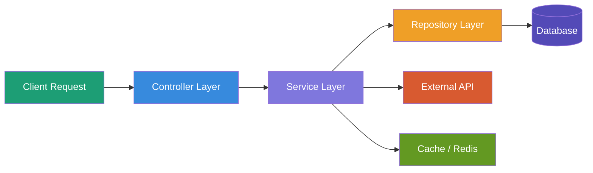
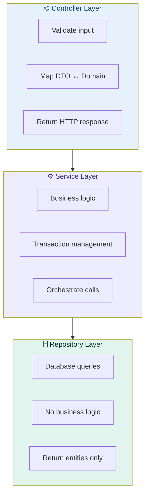
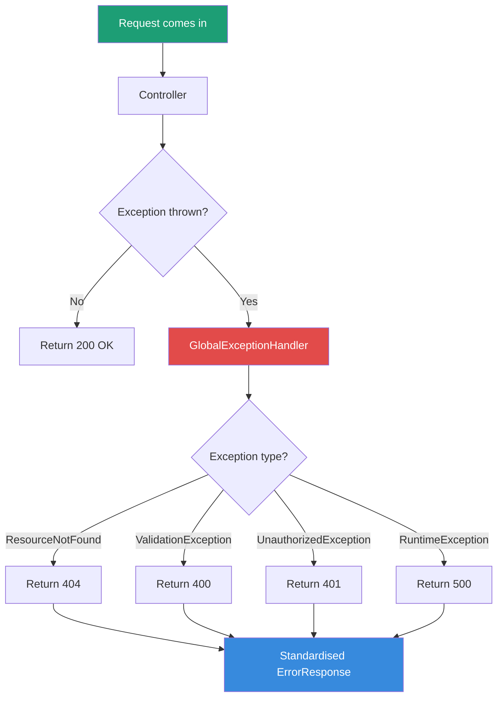
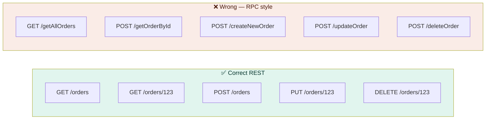
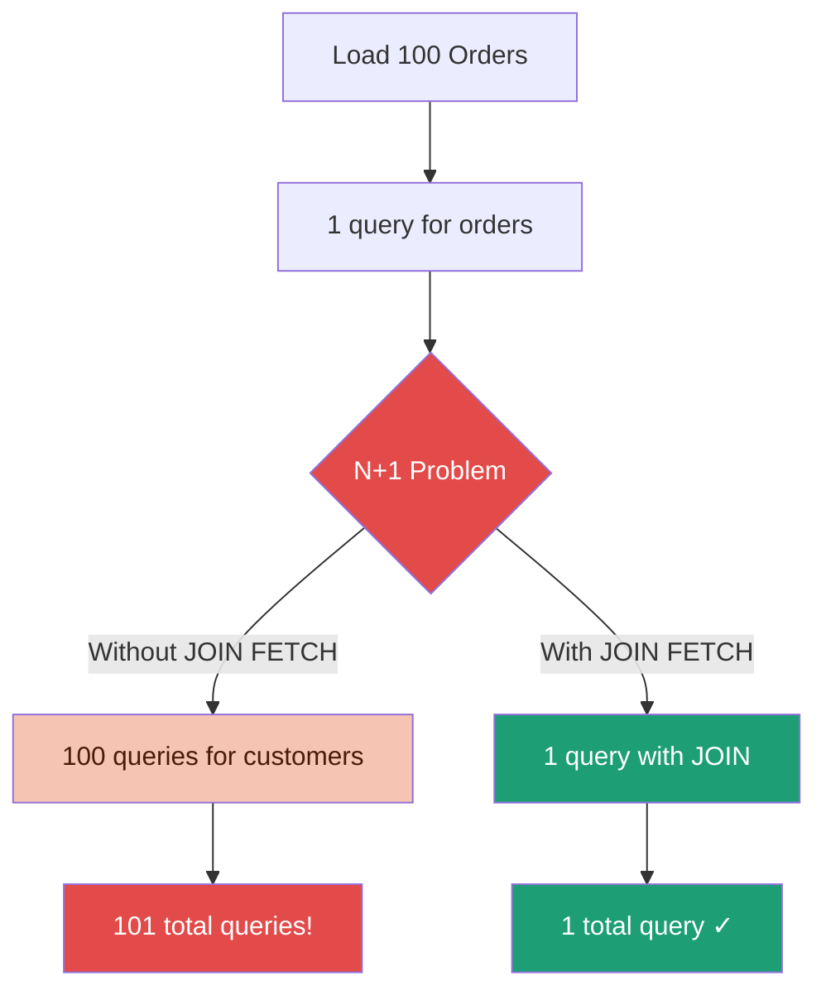
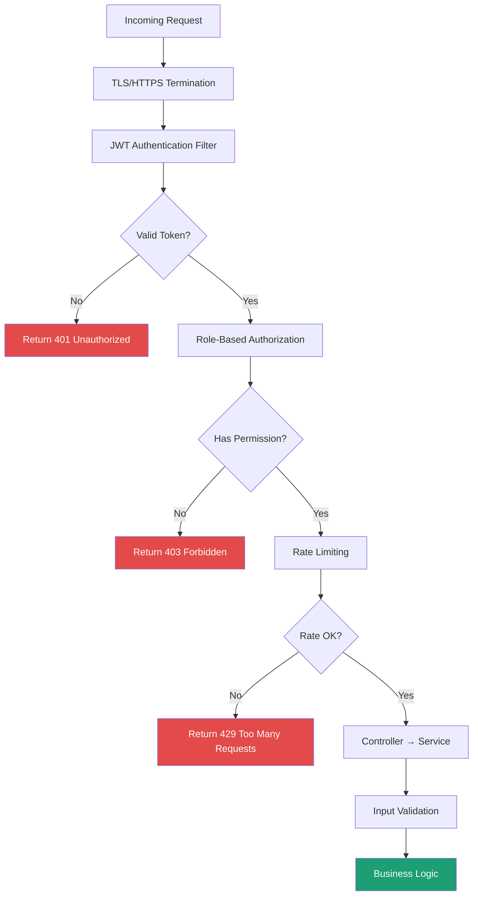
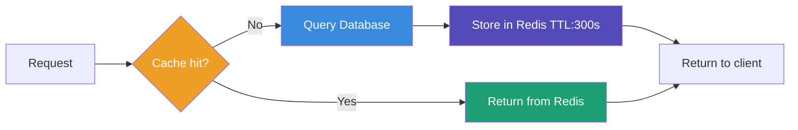
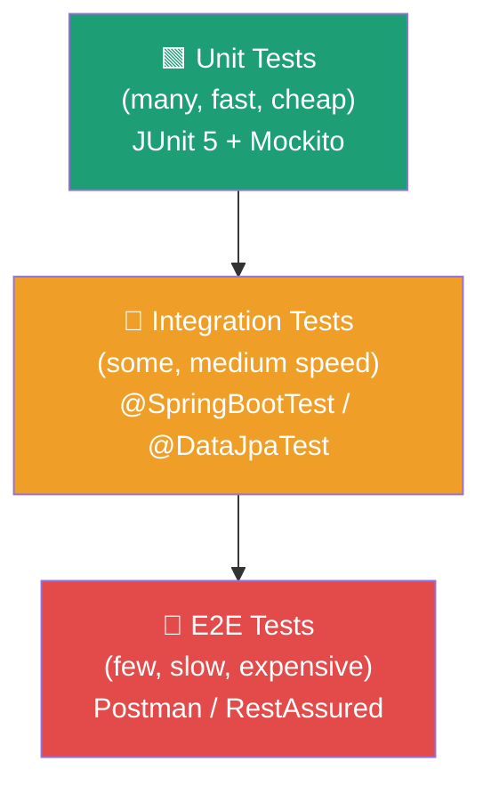
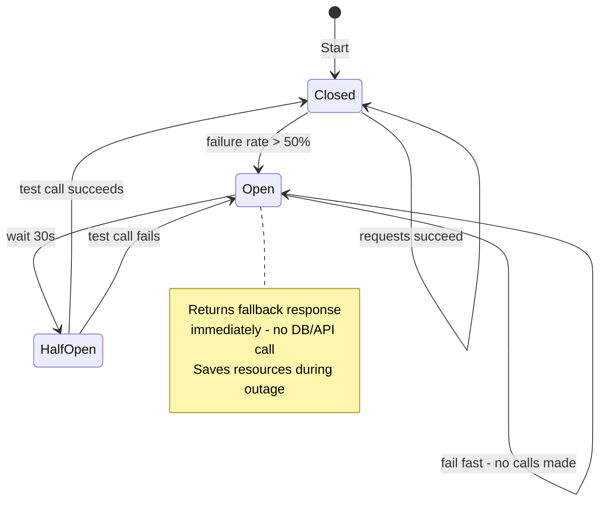

# 🍃 Spring Boot Best Practices
### Solution Architect Guide — Production-Grade Microservices

> **Audience:** Backend Engineers · Solution Architects · Tech Leads  
> **Stack:** Java 17+ · Spring Boot 3.x · AWS EKS · Microservices  
> **Version:** 1.0 · March 2026

---

## 📋 Table of Contents

| # | Topic | Priority |
|---|---|---|
| 1 | [Project Structure](#1-project-structure) | 🔴 P1 |
| 2 | [Configuration Management](#2-configuration-management) | 🔴 P1 |
| 3 | [Exception Handling](#3-exception-handling) | 🔴 P1 |
| 4 | [API Design](#4-api-design) | 🔴 P1 |
| 5 | [Database Best Practices](#5-database-best-practices) | 🔴 P1 |
| 6 | [Security](#6-security) | 🔴 P1 |
| 7 | [Logging & Observability](#7-logging--observability) | 🟡 P2 |
| 8 | [Performance & Caching](#8-performance--caching) | 🟡 P2 |
| 9 | [Testing](#9-testing) | 🟡 P2 |
| 10 | [Resilience Patterns](#10-resilience-patterns) | 🟡 P2 |
| 11 | [Docker & Deployment](#11-docker--deployment) | 🟡 P2 |
| 12 | [Actuator & Health Checks](#12-actuator--health-checks) | 🟢 P3 |

---

## 1. Project Structure

### ✅ Recommended — Package by Feature (Domain-Driven)

```
src/main/java/com/company/orderservice/
│
├── order/                          ← feature package
│   ├── OrderController.java
│   ├── OrderService.java
│   ├── OrderRepository.java
│   ├── Order.java                  ← entity
│   ├── OrderDTO.java               ← request/response
│   └── OrderMapper.java
│
├── payment/                        ← feature package
│   ├── PaymentController.java
│   ├── PaymentService.java
│   └── PaymentRepository.java
│
├── shared/                         ← shared utilities
│   ├── exception/
│   ├── config/
│   └── util/
│
└── OrderServiceApplication.java
```

### ❌ Wrong — Package by Layer (Avoid)

```
src/main/java/com/company/
├── controllers/          ← mixes all domains together
│   ├── OrderController.java
│   └── PaymentController.java
├── services/
│   ├── OrderService.java
│   └── PaymentService.java
└── repositories/
    ├── OrderRepository.java
    └── PaymentRepository.java
```

> 💡 **Why package by feature?**  
> All code for one business domain lives together.  
> Easier to understand, test, and extract into a microservice later.

---

### Architecture Flow



### Layer Responsibilities



---

## 2. Configuration Management

### ✅ Use Profile-Based Configuration

```
src/main/resources/
├── application.yml          ← common config
├── application-dev.yml      ← dev overrides
├── application-staging.yml  ← staging overrides
└── application-prod.yml     ← prod overrides
```

### application.yml — Common Base

```yaml
spring:
  application:
    name: order-service
  profiles:
    active: ${SPRING_PROFILE:dev}    # override via env var

server:
  port: 8080
  shutdown: graceful

management:
  endpoints:
    web:
      exposure:
        include: health,info,prometheus,metrics
```

### application-prod.yml — Production Only

```yaml
spring:
  datasource:
    url: ${DB_URL}                    # from Secrets Manager
    username: ${DB_USERNAME}
    password: ${DB_PASSWORD}
    hikari:
      minimum-idle: 5
      maximum-pool-size: 20
      connection-timeout: 30000
      idle-timeout: 600000
      max-lifetime: 1800000

  jpa:
    show-sql: false                   # NEVER true in production
    hibernate:
      ddl-auto: validate              # NEVER create/update in production

logging:
  level:
    root: WARN
    com.company: INFO
```

### ❌ Never Do This in Production

```yaml
spring:
  jpa:
    show-sql: true              # logs every SQL — kills performance
    hibernate:
      ddl-auto: create-drop     # DROPS your database on restart!
  datasource:
    password: mypassword        # hardcoded credential in file
```

> ⚠️ **`ddl-auto: create-drop` in production = data loss on every restart**  
> Always use `validate` in production and manage schema with Flyway/Liquibase.

---

## 3. Exception Handling

### ✅ Centralised Global Exception Handler



### Global Exception Handler

```java
@RestControllerAdvice
public class GlobalExceptionHandler {

    @ExceptionHandler(ResourceNotFoundException.class)
    @ResponseStatus(HttpStatus.NOT_FOUND)
    public ErrorResponse handleNotFound(ResourceNotFoundException ex) {
        return ErrorResponse.of(404, ex.getMessage());
    }

    @ExceptionHandler(MethodArgumentNotValidException.class)
    @ResponseStatus(HttpStatus.BAD_REQUEST)
    public ErrorResponse handleValidation(MethodArgumentNotValidException ex) {
        List<String> errors = ex.getBindingResult()
            .getFieldErrors()
            .stream()
            .map(e -> e.getField() + ": " + e.getDefaultMessage())
            .collect(Collectors.toList());
        return ErrorResponse.of(400, "Validation failed", errors);
    }

    @ExceptionHandler(Exception.class)
    @ResponseStatus(HttpStatus.INTERNAL_SERVER_ERROR)
    public ErrorResponse handleGeneral(Exception ex) {
        log.error("Unhandled exception", ex);
        return ErrorResponse.of(500, "Internal server error");
    }
}
```

### Standard Error Response

```java
@Builder
@JsonInclude(JsonInclude.Include.NON_NULL)
public record ErrorResponse(
    int status,
    String message,
    List<String> errors,
    Instant timestamp,
    String traceId          // for log correlation
) {
    public static ErrorResponse of(int status, String message) {
        return ErrorResponse.builder()
            .status(status)
            .message(message)
            .timestamp(Instant.now())
            .traceId(MDC.get("traceId"))
            .build();
    }
}
```

### Standard Error Response Shape

```json
{
  "status": 400,
  "message": "Validation failed",
  "errors": [
    "orderId: must not be null",
    "quantity: must be greater than 0"
  ],
  "timestamp": "2026-03-19T10:30:00Z",
  "traceId": "abc123def456"
}
```

---

## 4. API Design

### ✅ REST API Best Practices



### HTTP Methods — What to Use When

| Method | Use Case | Request Body | Response |
|---|---|---|---|
| `GET` | Fetch resource(s) | None | 200 OK |
| `POST` | Create new resource | Required | 201 Created |
| `PUT` | Full update | Required | 200 OK |
| `PATCH` | Partial update | Required | 200 OK |
| `DELETE` | Delete resource | None | 204 No Content |

### API Versioning

```java
// Option 1 — URL versioning (most common)
@RequestMapping("/api/v1/orders")
public class OrderControllerV1 { }

// Option 2 — Header versioning
@GetMapping(value = "/orders",
    headers = "X-API-Version=2")
public OrderResponseV2 getOrders() { }
```

### Request Validation

```java
public record CreateOrderRequest(
    @NotNull(message = "customerId is required")
    Long customerId,

    @NotEmpty(message = "items cannot be empty")
    List<OrderItemRequest> items,

    @Min(value = 1, message = "quantity must be at least 1")
    int quantity,

    @Email(message = "invalid email format")
    String notificationEmail
) {}

// Controller — validation triggered automatically
@PostMapping
@ResponseStatus(HttpStatus.CREATED)
public OrderResponse createOrder(@Valid @RequestBody CreateOrderRequest request) {
    return orderService.create(request);
}
```

---

## 5. Database Best Practices

### ✅ Schema Migration — Flyway

```
src/main/resources/db/migration/
├── V1__create_orders_table.sql
├── V2__add_order_status_column.sql
├── V3__create_index_on_customer_id.sql
└── V4__add_payment_table.sql
```

```sql
-- V1__create_orders_table.sql
CREATE TABLE orders (
    id          BIGSERIAL PRIMARY KEY,
    customer_id BIGINT NOT NULL,
    status      VARCHAR(20) NOT NULL DEFAULT 'PENDING',
    total       DECIMAL(10,2) NOT NULL,
    created_at  TIMESTAMP NOT NULL DEFAULT NOW(),
    updated_at  TIMESTAMP NOT NULL DEFAULT NOW()
);

CREATE INDEX idx_orders_customer_id ON orders(customer_id);
CREATE INDEX idx_orders_status ON orders(status);
```

### ✅ Connection Pooling — HikariCP

```yaml
spring:
  datasource:
    hikari:
      minimum-idle: 5          # keep 5 connections warm
      maximum-pool-size: 20    # max connections to DB
      connection-timeout: 30000
      idle-timeout: 600000
      max-lifetime: 1800000
      pool-name: OrderService-HikariPool
      auto-commit: false
```

### HikariCP Pool Sizing Formula

```
Pool size = Tn × (Cm - 1) + 1

Where:
  Tn = number of threads per pod
  Cm = max time a thread holds a connection

Simple rule: start with max-pool-size = 10
             monitor HikariCP metrics
             adjust based on wait time
```

### ✅ Use Projections for Read Queries

```java
// ❌ Wrong — loads entire entity when you only need two fields
List<Order> orders = orderRepository.findAll();

// ✅ Correct — projection loads only what you need
public interface OrderSummary {
    Long getId();
    String getStatus();
}

List<OrderSummary> summaries = orderRepository.findAllProjectedBy();
```

### ✅ Avoid N+1 Query Problem



```java
// ❌ Wrong — triggers N+1 queries
List<Order> orders = orderRepository.findAll();
orders.forEach(o -> log.info(o.getCustomer().getName())); // 1 query per order!

// ✅ Correct — single JOIN FETCH query
@Query("SELECT o FROM Order o JOIN FETCH o.customer WHERE o.status = :status")
List<Order> findByStatusWithCustomer(@Param("status") String status);
```

### Transaction Management

```java
@Service
@Transactional(readOnly = true)          // default: read-only for all methods
public class OrderService {

    public Order findById(Long id) {     // inherits readOnly = true
        return orderRepository.findById(id)
            .orElseThrow(() -> new ResourceNotFoundException("Order not found: " + id));
    }

    @Transactional                       // override: writable transaction
    public Order createOrder(CreateOrderRequest request) {
        Order order = orderMapper.toEntity(request);
        Order saved = orderRepository.save(order);
        eventPublisher.publish(new OrderCreatedEvent(saved.getId()));
        return saved;
    }
}
```

---

## 6. Security

### ✅ Security Layers



### JWT Security Configuration

```java
@Configuration
@EnableWebSecurity
@EnableMethodSecurity
public class SecurityConfig {

    @Bean
    public SecurityFilterChain filterChain(HttpSecurity http) throws Exception {
        return http
            .csrf(csrf -> csrf.disable())               // stateless API
            .sessionManagement(session ->
                session.sessionCreationPolicy(STATELESS))
            .authorizeHttpRequests(auth -> auth
                .requestMatchers("/actuator/health").permitAll()
                .requestMatchers("/api/v1/auth/**").permitAll()
                .requestMatchers(HttpMethod.GET, "/api/v1/orders/**")
                    .hasAnyRole("USER", "ADMIN")
                .requestMatchers(HttpMethod.DELETE, "/api/v1/orders/**")
                    .hasRole("ADMIN")
                .anyRequest().authenticated()
            )
            .oauth2ResourceServer(oauth2 ->
                oauth2.jwt(Customizer.withDefaults()))
            .build();
    }
}
```

### Method-Level Security

```java
@RestController
@RequestMapping("/api/v1/orders")
public class OrderController {

    @GetMapping
    @PreAuthorize("hasRole('USER')")
    public List<OrderResponse> getAllOrders() { }

    @DeleteMapping("/{id}")
    @PreAuthorize("hasRole('ADMIN')")
    public void deleteOrder(@PathVariable Long id) { }

    @GetMapping("/{id}")
    @PreAuthorize("hasRole('USER') and @orderSecurity.isOwner(#id, principal)")
    public OrderResponse getOrder(@PathVariable Long id) { }
}
```

### ✅ Never Expose Sensitive Data

```java
// ❌ Wrong — exposes internal entity directly
@GetMapping("/{id}")
public Order getOrder(@PathVariable Long id) {
    return orderRepository.findById(id).orElseThrow();
    // exposes: internal IDs, DB timestamps, all fields
}

// ✅ Correct — DTO controls what is exposed
@GetMapping("/{id}")
public OrderResponse getOrder(@PathVariable Long id) {
    Order order = orderService.findById(id);
    return orderMapper.toResponse(order);
    // exposes: only what client needs
}
```

---

## 7. Logging & Observability

### ✅ Structured Logging with Correlation IDs


### MDC Filter — Add Trace ID to Every Log

```java
@Component
@Order(Ordered.HIGHEST_PRECEDENCE)
public class CorrelationIdFilter extends OncePerRequestFilter {

    @Override
    protected void doFilterInternal(HttpServletRequest request,
                                     HttpServletResponse response,
                                     FilterChain chain) throws IOException, ServletException {
        String traceId = Optional
            .ofNullable(request.getHeader("X-Trace-Id"))
            .orElse(UUID.randomUUID().toString());

        MDC.put("traceId", traceId);
        MDC.put("userId", request.getHeader("X-User-Id"));
        response.addHeader("X-Trace-Id", traceId);

        try {
            chain.doFilter(request, response);
        } finally {
            MDC.clear();              // always clear MDC after request
        }
    }
}
```

### Logback Configuration — JSON Logs for ELK

```xml
<!-- logback-spring.xml -->
<configuration>
    <appender name="JSON" class="ch.qos.logback.core.ConsoleAppender">
        <encoder class="net.logstash.logback.encoder.LogstashEncoder">
            <includeMdcKeyName>traceId</includeMdcKeyName>
            <includeMdcKeyName>userId</includeMdcKeyName>
        </encoder>
    </appender>

    <springProfile name="prod">
        <root level="INFO">
            <appender-ref ref="JSON"/>
        </root>
    </springProfile>
</configuration>
```

### Log Output — Every Line Has Trace ID

```json
{
  "timestamp": "2026-03-19T10:30:00.000Z",
  "level": "INFO",
  "traceId": "abc123def456",
  "userId": "usr_789",
  "logger": "com.company.order.OrderService",
  "message": "Order created successfully",
  "orderId": 12345
}
```

### What to Log — What NOT to Log

| ✅ Log This | ❌ Never Log This |
|---|---|
| Request received (method, path, userId) | Passwords or secrets |
| Business event (order created, payment failed) | Credit card numbers |
| External API call result | PII — email, phone, SSN |
| Exception with stack trace | JWT tokens |
| Performance metrics | Full request/response body in prod |

---

## 8. Performance & Caching

### ✅ Caching with Redis



```java
@Service
public class ProductService {

    @Cacheable(
        value = "products",
        key = "#id",
        unless = "#result == null"
    )
    public ProductResponse getProduct(Long id) {
        return productRepository.findById(id)
            .map(productMapper::toResponse)
            .orElseThrow(() -> new ResourceNotFoundException("Product not found: " + id));
    }

    @CacheEvict(value = "products", key = "#id")
    @Transactional
    public ProductResponse updateProduct(Long id, UpdateProductRequest request) {
        Product product = productRepository.findById(id)
            .orElseThrow(() -> new ResourceNotFoundException("Product not found: " + id));
        productMapper.updateEntity(product, request);
        return productMapper.toResponse(productRepository.save(product));
    }

    @CacheEvict(value = "products", allEntries = true)
    public void clearAllCache() { }
}
```

```yaml
# application.yml — Redis cache config
spring:
  cache:
    type: redis
    redis:
      time-to-live: 300000        # 5 minutes TTL
      cache-null-values: false
  data:
    redis:
      host: ${REDIS_HOST}
      port: 6379
      timeout: 2000               # 2s connection timeout
```

### ✅ Async Processing

```java
@Service
public class NotificationService {

    // ❌ Wrong — blocks request thread for 2 seconds
    public void sendEmail(String to, String subject) {
        emailClient.send(to, subject);   // slow external call
    }

    // ✅ Correct — fire and forget, request returns immediately
    @Async("notificationExecutor")
    public CompletableFuture<Void> sendEmailAsync(String to, String subject) {
        return CompletableFuture.runAsync(() ->
            emailClient.send(to, subject));
    }
}

// Thread pool configuration
@Bean("notificationExecutor")
public Executor notificationExecutor() {
    ThreadPoolTaskExecutor executor = new ThreadPoolTaskExecutor();
    executor.setCorePoolSize(5);
    executor.setMaxPoolSize(20);
    executor.setQueueCapacity(100);
    executor.setThreadNamePrefix("notification-");
    executor.initialize();
    return executor;
}
```

---

## 9. Testing

### ✅ Testing Pyramid



### Unit Test — Service Layer

```java
@ExtendWith(MockitoExtension.class)
class OrderServiceTest {

    @Mock
    private OrderRepository orderRepository;

    @Mock
    private OrderMapper orderMapper;

    @InjectMocks
    private OrderService orderService;

    @Test
    @DisplayName("Should create order successfully when valid request provided")
    void shouldCreateOrderSuccessfully() {
        // Arrange
        CreateOrderRequest request = new CreateOrderRequest(1L, List.of(), 2, null);
        Order order = new Order();
        Order savedOrder = new Order();
        savedOrder.setId(100L);
        OrderResponse expectedResponse = new OrderResponse(100L, "PENDING");

        when(orderMapper.toEntity(request)).thenReturn(order);
        when(orderRepository.save(order)).thenReturn(savedOrder);
        when(orderMapper.toResponse(savedOrder)).thenReturn(expectedResponse);

        // Act
        OrderResponse result = orderService.createOrder(request);

        // Assert
        assertThat(result.id()).isEqualTo(100L);
        assertThat(result.status()).isEqualTo("PENDING");
        verify(orderRepository, times(1)).save(order);
    }

    @Test
    @DisplayName("Should throw ResourceNotFoundException when order not found")
    void shouldThrowExceptionWhenOrderNotFound() {
        when(orderRepository.findById(999L)).thenReturn(Optional.empty());

        assertThatThrownBy(() -> orderService.findById(999L))
            .isInstanceOf(ResourceNotFoundException.class)
            .hasMessageContaining("Order not found: 999");
    }
}
```

### Integration Test — Repository Layer

```java
@DataJpaTest
@AutoConfigureTestDatabase(replace = AutoConfigureTestDatabase.Replace.NONE)
@Testcontainers
class OrderRepositoryTest {

    @Container
    static PostgreSQLContainer<?> postgres =
        new PostgreSQLContainer<>("postgres:15-alpine");

    @DynamicPropertySource
    static void configureProperties(DynamicPropertyRegistry registry) {
        registry.add("spring.datasource.url", postgres::getJdbcUrl);
        registry.add("spring.datasource.username", postgres::getUsername);
        registry.add("spring.datasource.password", postgres::getPassword);
    }

    @Autowired
    private OrderRepository orderRepository;

    @Test
    void shouldFindOrdersByStatus() {
        Order order = new Order();
        order.setStatus("PENDING");
        order.setCustomerId(1L);
        orderRepository.save(order);

        List<Order> result = orderRepository.findByStatus("PENDING");

        assertThat(result).hasSize(1);
        assertThat(result.get(0).getStatus()).isEqualTo("PENDING");
    }
}
```

### Controller Test — API Layer

```java
@WebMvcTest(OrderController.class)
class OrderControllerTest {

    @Autowired
    private MockMvc mockMvc;

    @MockBean
    private OrderService orderService;

    @Test
    void shouldReturn201WhenOrderCreated() throws Exception {
        OrderResponse response = new OrderResponse(1L, "PENDING");
        when(orderService.createOrder(any())).thenReturn(response);

        mockMvc.perform(post("/api/v1/orders")
                .contentType(MediaType.APPLICATION_JSON)
                .content("""
                    {
                        "customerId": 1,
                        "quantity": 2
                    }
                    """))
            .andExpect(status().isCreated())
            .andExpect(jsonPath("$.id").value(1))
            .andExpect(jsonPath("$.status").value("PENDING"));
    }

    @Test
    void shouldReturn400WhenValidationFails() throws Exception {
        mockMvc.perform(post("/api/v1/orders")
                .contentType(MediaType.APPLICATION_JSON)
                .content("{}"))                  // empty body — fails validation
            .andExpect(status().isBadRequest())
            .andExpect(jsonPath("$.status").value(400));
    }
}
```

---

## 10. Resilience Patterns

### ✅ Circuit Breaker + Retry + Timeout



```java
@Service
public class PaymentService {

    @CircuitBreaker(name = "payment", fallbackMethod = "paymentFallback")
    @Retry(name = "payment")
    @TimeLimiter(name = "payment")
    public CompletableFuture<PaymentResponse> processPayment(PaymentRequest request) {
        return CompletableFuture.supplyAsync(() ->
            paymentClient.process(request));
    }

    // Called when circuit is open or all retries exhausted
    public CompletableFuture<PaymentResponse> paymentFallback(
            PaymentRequest request, Exception ex) {
        log.warn("Payment service unavailable, returning fallback. Error: {}", ex.getMessage());
        return CompletableFuture.completedFuture(
            PaymentResponse.pending("Payment queued for retry"));
    }
}
```

```yaml
# application.yml — Resilience4j config
resilience4j:
  circuitbreaker:
    instances:
      payment:
        sliding-window-size: 10
        failure-rate-threshold: 50          # open after 50% failures
        wait-duration-in-open-state: 30s    # wait 30s before retry
        permitted-calls-in-half-open-state: 3

  retry:
    instances:
      payment:
        max-attempts: 3
        wait-duration: 1s
        retry-exceptions:
          - java.io.IOException
          - java.util.concurrent.TimeoutException

  timelimiter:
    instances:
      payment:
        timeout-duration: 3s               # fail after 3s
```

---

## 11. Docker & Deployment

### ✅ Multi-Stage Dockerfile

```dockerfile
# Stage 1 — Build
FROM eclipse-temurin:17-jdk-alpine AS builder
WORKDIR /build
COPY pom.xml .
COPY src ./src
RUN ./mvnw package -DskipTests -q

# Stage 2 — Extract layers for caching
FROM eclipse-temurin:17-jre-alpine AS layers
WORKDIR /app
COPY --from=builder /build/target/*.jar app.jar
RUN java -Djarmode=layertools -jar app.jar extract

# Stage 3 — Final lean image
FROM eclipse-temurin:17-jre-alpine
RUN addgroup -S appgroup && adduser -S appuser -G appgroup
WORKDIR /app

COPY --from=layers /app/dependencies/ ./
COPY --from=layers /app/spring-boot-loader/ ./
COPY --from=layers /app/snapshot-dependencies/ ./
COPY --from=layers /app/application/ ./

USER appuser
EXPOSE 8080

ENTRYPOINT ["java", \
  "-XX:MaxRAMPercentage=75.0", \
  "-XX:+UseContainerSupport", \
  "-Djava.security.egd=file:/dev/./urandom", \
  "org.springframework.boot.loader.launch.JarLauncher"]
```

### Docker Image Size Comparison

| Base Image | Size | Use Case |
|---|---|---|
| `eclipse-temurin:17-jdk` | ~340MB | Build only |
| `eclipse-temurin:17-jre` | ~210MB | Runtime (standard) |
| `eclipse-temurin:17-jre-alpine` | ~90MB | ✅ Runtime (recommended) |
| `eclipse-temurin:17-jre-alpine` + app | ~120MB | Final image size |

### ✅ Environment-Specific Config via Env Vars

```yaml
# docker-compose.yml — local development
services:
  order-service:
    image: order-service:latest
    environment:
      SPRING_PROFILES_ACTIVE: dev
      DB_URL: jdbc:postgresql://postgres:5432/orders
      DB_USERNAME: orderuser
      DB_PASSWORD: localpassword
      REDIS_HOST: redis
    ports:
      - "8080:8080"
    depends_on:
      - postgres
      - redis
```

---

## 12. Actuator & Health Checks

### ✅ Custom Health Indicators

```java
@Component
public class DatabaseHealthIndicator implements HealthIndicator {

    @Autowired
    private DataSource dataSource;

    @Override
    public Health health() {
        try (Connection conn = dataSource.getConnection()) {
            if (conn.isValid(1)) {
                return Health.up()
                    .withDetail("database", "PostgreSQL")
                    .withDetail("status", "reachable")
                    .build();
            }
        } catch (SQLException e) {
            return Health.down()
                .withDetail("error", e.getMessage())
                .build();
        }
        return Health.down().build();
    }
}
```

### Health Check Response for K8s Probes

```json
GET /actuator/health/liveness
{
  "status": "UP"
}

GET /actuator/health/readiness
{
  "status": "UP",
  "components": {
    "db": { "status": "UP" },
    "redis": { "status": "UP" },
    "diskSpace": { "status": "UP" }
  }
}
```

### Actuator Endpoints Reference

| Endpoint | Purpose | Expose in Prod? |
|---|---|---|
| `/actuator/health` | Overall health | ✅ Yes |
| `/actuator/health/liveness` | K8s liveness probe | ✅ Yes |
| `/actuator/health/readiness` | K8s readiness probe | ✅ Yes |
| `/actuator/prometheus` | Prometheus metrics | ✅ Yes (internal only) |
| `/actuator/info` | App version info | ✅ Yes |
| `/actuator/env` | Environment properties | ❌ No — leaks secrets |
| `/actuator/beans` | All Spring beans | ❌ No |
| `/actuator/mappings` | All API mappings | ❌ No |

---

## 📊 Complete Best Practices Checklist

### 🏗️ Architecture
- [ ] Package by feature, not by layer
- [ ] Separate Controller / Service / Repository layers
- [ ] Use DTOs — never expose entities directly
- [ ] Use MapStruct for entity ↔ DTO mapping

### ⚙️ Configuration
- [ ] Profile-based configuration (dev/staging/prod)
- [ ] All secrets from environment variables / Secrets Manager
- [ ] `ddl-auto: validate` in production
- [ ] `show-sql: false` in production

### 🚨 Error Handling
- [ ] `@RestControllerAdvice` global exception handler
- [ ] Standardised `ErrorResponse` DTO
- [ ] Custom exception classes per domain
- [ ] Never expose internal stack traces to clients

### 🔌 API Design
- [ ] REST naming conventions (nouns not verbs)
- [ ] `@Valid` on all request bodies
- [ ] API versioning (`/api/v1/`)
- [ ] Consistent HTTP status codes

### 🗄️ Database
- [ ] Flyway or Liquibase for migrations
- [ ] HikariCP pool sizing configured
- [ ] `@Transactional(readOnly = true)` on read methods
- [ ] No N+1 queries — use JOIN FETCH or projections
- [ ] Indexes on frequently queried columns

### 🔒 Security
- [ ] JWT authentication configured
- [ ] Role-based access with `@PreAuthorize`
- [ ] DTOs prevent over-exposure of data
- [ ] Input validation on all endpoints
- [ ] No sensitive data in logs

### 📊 Observability
- [ ] Correlation ID / trace ID in every log
- [ ] Structured JSON logs (Logstash encoder)
- [ ] MDC cleared after every request
- [ ] Prometheus metrics exposed
- [ ] Health indicators for external dependencies

### ⚡ Performance
- [ ] Redis caching for expensive reads
- [ ] `@Async` for non-blocking operations
- [ ] Dedicated thread pools for async tasks
- [ ] Database query optimisation

### 🧪 Testing
- [ ] Unit tests for service layer (Mockito)
- [ ] Integration tests with Testcontainers
- [ ] `@WebMvcTest` for controller layer
- [ ] Test coverage ≥ 80%

### 💪 Resilience
- [ ] Circuit breaker for external API calls
- [ ] Retry with backoff configured
- [ ] Timeout on all external calls
- [ ] Fallback methods defined

### 🐳 Docker
- [ ] Multi-stage Dockerfile
- [ ] Non-root user in container
- [ ] Alpine-based JRE image
- [ ] `MaxRAMPercentage` JVM flag set

### 🏥 Actuator
- [ ] Liveness and readiness endpoints enabled
- [ ] Sensitive endpoints (`/env`, `/beans`) NOT exposed
- [ ] Custom health indicators for dependencies
- [ ] Build info exposed via `/actuator/info`

---

## 🚦 Priority Summary

| Priority | What | Impact |
|---|---|---|
| 🔴 **P1 — Do First** | Global exception handler | Prevents raw stack traces leaking to clients |
| 🔴 **P1 — Do First** | Request validation with @Valid | Prevents bad data entering system |
| 🔴 **P1 — Do First** | No secrets in config files | Prevents credential leaks |
| 🔴 **P1 — Do First** | Flyway migrations | Prevents uncontrolled schema changes |
| 🔴 **P1 — Do First** | `ddl-auto: validate` in prod | Prevents accidental data loss |
| 🟡 **P2 — This Sprint** | Correlation ID logging | Makes debugging in prod possible |
| 🟡 **P2 — This Sprint** | Circuit breaker on external calls | Prevents cascade failures |
| 🟡 **P2 — This Sprint** | Connection pool tuning | Prevents DB connection exhaustion |
| 🟡 **P2 — This Sprint** | Cache expensive reads | Reduces DB load significantly |
| 🟢 **P3 — Next Sprint** | Testcontainers integration tests | Catches DB bugs before prod |
| 🟢 **P3 — Next Sprint** | Multi-stage Docker build | Reduces image size by 60% |
| 🟢 **P3 — Next Sprint** | Custom health indicators | Better K8s probe accuracy |

---

*Document version 1.0 · Solution Architecture Team · March 2026*  
*Spring Boot 3.x · Java 17+ · AWS EKS · Production Grade*
